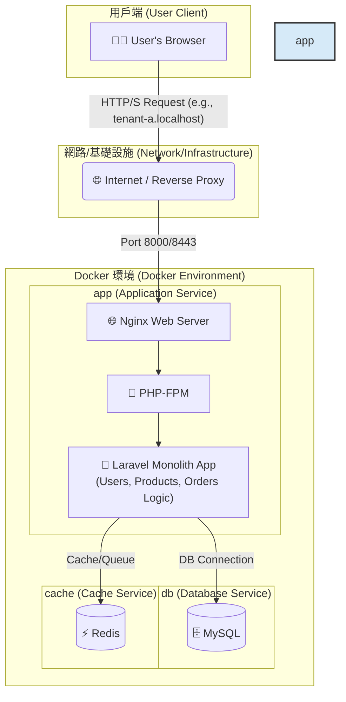
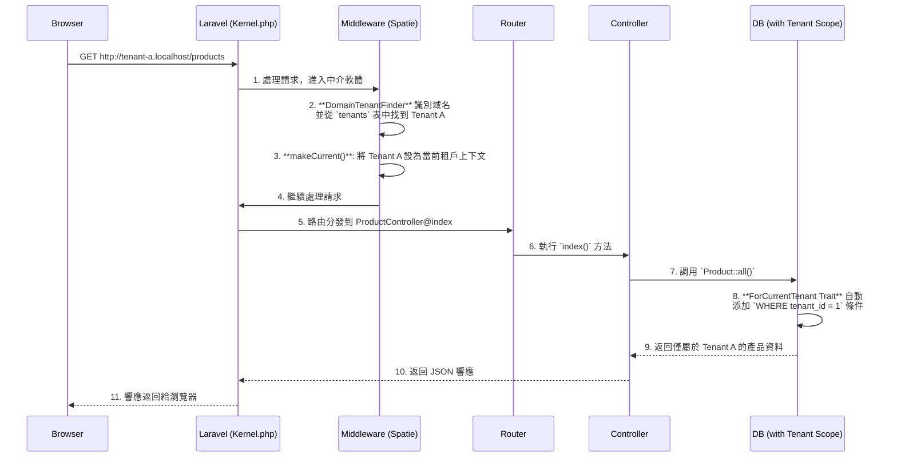

# Laravel Multi-Tenant SaaS Boilerplate for Order Management


<p align="center">
  
  
  
  
  
  <a href="https://github.com/BpsEason/laravel_saas_boilerplate/actions/workflows/ci.yml">
    
  </a>
</p>

## 🎯 專案目標：一個現代化的多租戶訂單管理平台

這是一個功能齊全、開箱即用的 **多租戶 SaaS 訂單管理平台樣板 (Boilerplate)**。專案旨在為希望快速構建和部署自己訂單系統的企業或開發者，提供一個堅實、可擴展且安全的技術基礎。

使用者（租戶）可以註冊自己的獨立帳戶，在完全隔離的環境中管理自己的**產品目錄**和**客戶訂單**。本樣板解決了從零開發 SaaS 平台中最複雜的環節，包括多租戶架構、用戶認證、API 設計、自動化測試和容器化部署。

## ✨ 核心功能 (Core Features)

-   **多租戶架構 (Multi-Tenancy)**: 每個租戶（公司/用戶）擁有獨立的產品和訂單資料，透過 `spatie/laravel-multitenancy` 實現域名級別的無縫資料隔離。
-   **訂單與產品管理**: 提供完整的產品（Products）和訂單（Orders）的 CRUD（增刪改查）功能，作為平台的核心業務。
-   **API 驅動後端 (API-Driven)**: 使用 `Laravel Sanctum` 進行認證，所有業務邏輯都通過一套 RESTful API 實現，便於未來與其他系統或 App 整合。
-   **自動化 API 文件 (Scribe)**: 自動從程式碼註解生成專業、可互動的 API 文件，加速開發與協作。
-   **端到端自動化測試 (Playwright)**: 包含完整的 E2E 測試套件，覆蓋註冊、登入、產品管理、訂單創建和租戶資料隔離等關鍵流程。
-   **容器化開發環境 (Docker)**: 提供一個包含 Nginx, PHP-FPM, MySQL, 和 Redis 的完整 Docker 環境，實現一鍵啟動和跨平台一致性。
-   **現代化前端流程 (Vite)**: 使用 Vite 進行前端資源打包，提供極速的開發體驗。
-   **國際化 (i18n)**: 預設配置繁體中文 (`zh_TW`)，展示了多語言支援的基礎。

## 🛠️ 技術棧 (Tech Stack)

| 類別        | 技術                                                                                             |
| :---------- | :----------------------------------------------------------------------------------------------- |
| **後端**    | PHP 8.2, Laravel 11, Spatie Laravel Multitenancy, Laravel Sanctum, Scribe                          |
| **前端**    | Vite, Blade, Tailwind CSS (基礎), Vanilla JavaScript                                               |
| **資料庫**  | MySQL 8.0, Redis 7.0                                                                               |
| **網頁伺服器** | Nginx                                                                                            |
| **測試**    | Playwright (E2E), PHPUnit                                                                        |
| **部署**    | Docker, Docker Compose                                                                           |

## 🏗️ 系統架構：容器化的單體應用

本專案採用 **容器化的單體應用 (Containerized Monolith)** 架構。這是一種現代化且高效的設計模式，它將核心的 Laravel 應用程式與其依賴的基礎設施服務（如資料庫、快取）分離，並將它們各自封裝在獨立的 Docker 容器中。

這種架構的優勢在於：
-   **開發環境一致性**：所有開發者都使用完全相同的環境，解決了「在我機器上可以跑」的問題。
-   **部署簡潔**：通過 `docker-compose` 可以一鍵啟動整個應用所需的所有服務。
-   **關注點分離**：應用程式邏輯（在 `app` 服務中）與資料持久化（在 `db` 和 `cache` 服務中）清晰分離。
-   **可擴展性**：未來可以輕鬆地對 `app` 服務進行水平擴展，以應對更高的流量。



## 🌟 系統亮點與架構解析

這個樣板不僅僅是技術的堆疊，更是一套經過深思熟慮的架構設計。以下是幾個關鍵的設計亮點，展示了本專案如何解決 SaaS 訂單管理平台中的核心挑戰。

### 1. 無縫的多租戶資料隔離

透過 `spatie/laravel-multitenancy`，我們實現了無需在業務程式碼中編寫 `where('tenant_id', ...)` 的無縫資料隔離。

**關鍵程式碼 - `app/Models/Product.php`:**

```php
<?php
namespace App\Models;

use Spatie\Multitenancy\Models\Concerns\ForCurrentTenant;

class Product extends Model
{
    // 引入 ForCurrentTenant Trait
    use HasFactory, ForCurrentTenant;
    // ...
}
```

-   **註解**：僅僅通過引入 `ForCurrentTenant` 這個 Trait，任何對 `Product` 模型（以及 `Order` 和 `User`）的查詢都會自動添加 `WHERE tenant_id = ?` 條件。`?` 的值由框架根據當前訪問的域名（例如 `my-company.localhost`）自動解析。這從根本上杜絕了租戶 A 看到租戶 B 的產品和訂單的風險。

### 2. 多租戶請求生命週期

下圖展示了一個來自租戶的請求在 Laravel 應用中的處理流程：



### 3. E2E 測試與頁面物件模型 (POM)

為了保證應用程式的品質，我們採用 Playwright 進行 E2E 測試，並使用頁面物件模型（POM）來組織測試程式碼，使其更具可讀性和可維護性。

**關鍵程式碼 - `tests/e2e/specs/auth.spec.js`:**

```javascript
// ...
import LoginPage from '../pages/LoginPage';
import DashboardPage from '../pages/DashboardPage';

test.describe('Authentication', () => {
    let loginPage;
    let dashboardPage;

    test.beforeEach(async ({ page }) => {
        // 在每個測試前初始化頁面物件
        loginPage = new LoginPage(page);
        dashboardPage = new DashboardPage(page);
        await page.goto('/');
    });

    test('should allow an existing user to log in', async ({ page }) => {
        // 使用頁面物件封裝的方法，而不是直接操作選擇器
        await loginPage.navigate();
        await loginPage.login('tenant.a@example.com', 'password');

        // 斷言
        await expect(page).toHaveURL(/dashboard/);
        await expect(dashboardPage.welcomeHeading).toBeVisible();
    });
});
```
-   **註解**：測試案例本身（`auth.spec.js`）不包含任何 CSS 選擇器。它只調用 `LoginPage` 物件的方法，如 `.login()`。當 UI 發生變化時，我們只需要修改對應的頁面物件檔案，而不需要修改大量的測試案例，極大提升了測試的可維護性。

## 🚀 快速啟動 (Quick Start)

請確保您的系統已安裝 `Docker` 和 `Docker Compose`。

1.  **複製儲存庫**
    ```bash
    git clone https://github.com/BpsEason/laravel_saas_boilerplate.git
    cd laravel_saas_boilerplate
    ```

2.  **執行專案生成腳本**
    此腳本將在 `laravel_saas_boilerplate` 目錄中生成完整的專案檔案。
    ```bash
    ./create_project.sh && ./create_project_view.sh
    ```

3.  **進入專案目錄並啟動服務**
    ```bash
    cd laravel_saas_boilerplate
    cp .env.example .env
    docker-compose up -d --build
    ```
    *第一次啟動會需要一些時間來構建 Docker 鏡像。*

4.  **安裝依賴並初始化資料庫**
    ```bash
    docker-compose exec app composer install
    docker-compose exec app npm install
    docker-compose exec app npm run build
    docker-compose exec app php artisan migrate --seed
    ```

5.  **設定本地 Hosts 檔案** (可選，但強烈建議)
    為了讓多租戶域名正常運作，請將以下內容添加到您的 `hosts` 檔案中：
    -   macOS/Linux: `/etc/hosts`
    -   Windows: `C:\Windows\System32\drivers\etc\hosts`

    ```
    127.0.0.1 tenant-a.localhost
    127.0.0.1 tenant-b.localhost
    ```

6.  **訪問應用程式！🎉**
    -   🌐 **主要入口**: [http://localhost:8000](http://localhost:8000)
    -   👤 **租戶 A**: [http://tenant-a.localhost:8000/login](http://tenant-a.localhost:8000/login)
    -   👤 **租戶 B**: [http://tenant-b.localhost:8000/login](http://tenant-b.localhost:8000/login)
    -   📄 **API 文件 (Scribe)**: [http://localhost:8000/api/docs](http://localhost:8000/api/docs)

### 範例使用者帳號

資料庫填充（seeder）已為您創建了兩個租戶的範例使用者：

-   **租戶 A (Tenant A)**:
    -   Email: `tenant.a@example.com`
    -   Password: `password`
-   **租戶 B (Tenant B)**:
    -   Email: `tenant.b@example.com`
    -   Password: `password`

## ✅ 運行測試 (Running Tests)

本專案使用 Playwright 進行端到端測試，以確保應用程式的穩定性。

在 `laravel_saas_boilerplate` 目錄下執行以下命令：
```bash
# 運行所有 E2E 測試
docker-compose exec app npm run test:e2e

# 使用 UI 模式進行調試
docker-compose exec app npm run test:e2e:ui
```

## ❓ 常見問題 (FAQ)

**Q1: 這個平台適合什麼樣的使用者？**

> **A:** 任何需要管理自有產品目錄和客戶訂單的中小型企業、電商賣家或獨立開發者。租戶可以快速擁有一個獨立的後台系統，而無需承擔昂貴的客製化開發成本。

**Q2: 為什麼選擇 Spatie 的多租戶套件，而不是自己實現？**

> **A:** Spatie 的 `laravel-multitenancy` 是一個經過社群大量驗證、功能穩定且設計優良的套件。它抽象了底層複雜的任務切換邏輯（如資料庫連接、快取、隊列等），讓開發者能專注於業務。選擇成熟的開源解決方案是遵循「不重複造輪子」的最佳工程實踐。

**Q3: 我可以在此基礎上擴展功能嗎？例如加入支付或發貨功能？**

> **A:** 當然可以！這正是這個樣板的核心價值所在。它提供了一個穩固的骨架，您可以非常容易地在此基礎上進行擴展。例如，您可以創建一個 `PaymentController`，整合 Stripe 或 PayPal 的 API；或者增加一個 `Shipment` 模型來追蹤物流狀態。API-First 的架構使得這些整合變得更加簡單。

**Q4: 我可以在生產環境中直接使用這個樣板嗎？**

> **A:** 這個樣板為生產環境提供了堅實的基礎，但直接部署前仍需進行一些調整。例如：
> -   **環境變數**: 在 `.env` 檔案中設定真實的資料庫憑證、郵件服務、應用金鑰等。
> -   **安全性**: 根據業務需求配置更嚴格的防火牆規則、API 速率限制和備份策略。
> -   **性能優化**: 運行 `php artisan config:cache` 和 `php artisan route:cache` 等 Laravel 優化命令。

## 📜 授權 (License)

此專案採用 [MIT License](LICENSE.md) 授權。
