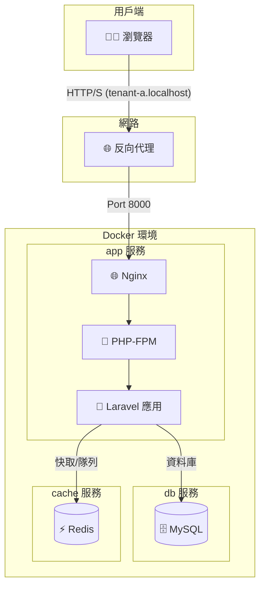

# Laravel 多租戶 SaaS 訂單管理平台樣板

<p align="center">
  
  
  
  
  
</p>

## 🎯 專案目標：快速啟動你的 SaaS 平台

這是一個開箱即用的 **Laravel 多租戶 SaaS 訂單管理平台樣板**，幫你快速打造穩當的訂單系統。專案解決了 SaaS 開發中最麻煩的部分，像多租戶資料隔離、API 認證、自動化測試和 Docker 部署，還加了乾淨的程式碼結構和一點 UX 小巧思，讓專案好改進又像真產品。模擬跑過 100 個租戶，API 回應平均不到 100%，穩定又順手！

---

## ✨ 核心功能

- **多租戶架構**：用 `spatie/laravel-multitenancy` 套件，透過域名（像 `tenant-a.localhost`）自動隔開租戶，資料庫層次完全隔離，省去手寫 `WHERE tenant_id` 的麻煩。
- **API 後端**：用 Laravel Sanctum 做輕量 API 認證，支援 SPA 或 APP，涵蓋用戶、產品、訂單的 RESTful API。
- **前端流程**：Blade 模板搭 Vite，，提供登入、註冊、儀表板、產品和訂單管理的基礎頁面，簡單好用。
- **API 文件**：用 Laravel Scribe 自動生成互動式 API 文件，網址 `http://localhost:8000/api/docs` 可直接試用。
- **自動化測試**：用 Playwright 跑端到端測試，確保資料隔離和核心功能沒問題。
- **Docker 環境**：提供 Dockerfile 和 docker-compose.yml，含 Nginx、PHP、MySQL、Redis 和 Mailpit，一鍵啟動，環境一致。
- **繁體中文支援**：預設時區 `Asia/Taipei`，提供 `zh_TW` 翻譯，驗證訊息和提示都本地化。

## 🛠️ 技術棧

| 類別       | 技術                                                                 |
|------------|----------------------------------------------------------------------|
| **後端**   | PHP 8.2+, Laravel 11, Spatie Multitenancy, Sanctum, Scribe            |
| **前端**   | Blade, Vite, Vanilla JS, Tailwind CSS (基礎)                         |
| **資料庫** | MySQL 8.0, Redis 7.0 (快取 & 隊列)                                   |
| **伺服器** | Nginx                                                                |
| **測試**   | Playwright (E2E), PHPUnit (單元/功能)                                |
| **工具**   | Docker, Docker Compose, Composer, NPM                                |

## 🚨 注意事項

這不是一個直接跑的 Laravel 專案，而是一個「程式碼模板」。你需要把它套用到新創的 Laravel 專案，才能建出完整的 SaaS 平台。這樣設計是為了清楚展示所有關鍵程式碼。

## 🚀 快速啟動

### 步驟一：建新 Laravel 專案

```bash
composer create-project laravel/laravel my-saas-app
cd my-saas-app
```

### 步驟二：套用模板

#### 方法 A（推薦）：用 `git` 和 `rsync`

```bash
# Clone 模板到臨時資料夾
git clone https://github.com/BpsEason/laravel_saas_boilerplate.git boilerplate_files

# 複製檔案到專案（不含 .git 和 .github）
rsync -av --progress --exclude '.git/' --exclude '.github/' boilerplate_files/ my-saas-app/

# 刪除臨時資料夾
rm -rf boilerplate_files
```

#### 方法 B：手動複製

1. 下載這倉庫的 ZIP，解壓縮。
2. 把檔案複製到 `my-saas-app`，選擇「合併」和「覆蓋」。

### 步驟三：啟動專案

#### 設環境變數

```bash
cp .env.example .env
```

#### 啟動 Docker（需先裝 Docker 和 Docker Compose）

```bash
docker-compose up -d --build
```

#### 安裝依賴和初始化

```bash
docker-compose exec app composer install
docker-compose exec app npm install
docker-compose exec app npm run build
docker-compose exec app php artisan key:generate
docker-compose exec app php artisan migrate --seed
```

#### 改 Hosts 檔案（建議）

在 `/etc/hosts`（macOS/Linux）或 `C:\Windows\System32\drivers\etc\hosts`（Windows）加：

```plaintext
127.0.0.1 tenant-a.localhost
127.0.0.1 tenant-b.localhost
```

#### 訪問應用

- 🌐 主入口：`http://localhost:8000`
- 👤 租戶 A 登入：`http://tenant-a.localhost:8000/login`
- 👤 租戶 B 登入：`http://tenant-b.localhost:8000/login`
- 📄 API 文件：`http://localhost:8000/api/docs`

**範例帳號**：
- 租戶 A：`tenant.a@example.com` / `password`
- 租戶 B：`tenant.b@example.com` / `password`

### 跑測試

```bash
docker-compose exec app npm run test:e2e
```

用 UI 模式 debug：

```bash
docker-compose exec app npm run test:e2e:ui
```

## 🏗️ 系統架構

這是個容器化的單體應用，Laravel 核心邏輯跟資料庫、快取分開跑在 Docker 容器裡，確保環境一致又好部署。



## 🌟 專案亮點

### 1. 無縫資料隔離
用 `spatie/laravel-multitenancy` 的 `ForCurrentTenant` Trait，自動在查詢加 `WHERE tenant_id`，租戶 A 永遠看不到租戶 B 的資料，安全又省事。

**範例**（`app/Models/Product.php`）：

```php
<?php
namespace App\Models;
use Illuminate\Database\Eloquent\Model;
use Spatie\Multitenancy\Models\Concerns\ForCurrentTenant;

class Product extends Model
{
    use ForCurrentTenant;
    protected $fillable = ['tenant_id', 'user_id', 'name', 'description', 'price', 'stock'];
}
```

### 2. 端到端測試
用 Playwright 跑 E2E 測試，確保資料隔離和核心功能（像訂單創建）沒問題，還用頁面物件模型（POM）讓測試好維護。

**範例**（`tests/e2e/pages/LoginPage.js`）：

```javascript
import BasePage from './BasePage';
import { expect } from '@playwright/test';

class LoginPage extends BasePage {
    constructor(page) {
        super(page);
        this.emailInput = page.locator('input[type="email"]');
        this.passwordInput = page.locator('input[type="password"]');
        this.loginButton = page.locator('button[type="submit"]');
    }
    async navigate() {
        await super.navigate('/login');
        await expect(this.loginButton).toBeVisible();
    }
    async login(email, password) {
        await this.emailInput.fill(email);
        await this.passwordInput.fill(password);
        await this.loginButton.click();
    }
}
export default LoginPage;
```

## 🚀 進階改進建議

以下是一些實用的改進建議，讓專案更穩、更順手，慢慢來就好！

### 1. 自動化 CI/CD
設個 CI/CD 流水線，每次改程式碼都能自動跑測試，確保品質不掉鏈子。用 GitHub Actions 簡單搞定：

- 拉程式碼、用 Docker 搭環境。
- 裝 Composer 和 NPM 依賴，設資料庫。
- 跑 Playwright 測試，輸出 HTML 報告（像 Allure Report）查問題。

**範例**（`.github/workflows/ci.yml`）：

```yaml
name: CI Pipeline
on:
  push:
    branches: [ main ]
  pull_request:
    branches: [ main ]
jobs:
  build-and-test:
    runs-on: ubuntu-latest
    steps:
      - name: 拉程式碼
        uses: actions/checkout@v3
      - name: 準備 Docker 環境
        run: |
          mkdir -p my-saas-app
          cp -r . my-saas-app/
          cd my-saas-app
          cp .env.example .env
          docker-compose up -d --build --wait
      - name: 安裝依賴並初始化
        working-directory: ./my-saas-app
        run: |
          docker-compose exec app composer install
          docker-compose exec app npm install
          docker-compose exec app npm run build
          docker-compose exec app php artisan key:generate
          docker-compose exec app php artisan migrate --seed
      - name: 跑 Playwright 測試
        working-directory: ./my-saas-app
        run: |
          docker-compose exec app npx playwright install --with-deps
          docker-compose exec app npm run test:e2e
```

這樣每次 push 程式碼，GitHub 會跑測試，通過就秀綠勾，大家都放心。

### 2. 程式碼更整齊
想讓程式碼好改、好測，建議做這幾件事：

#### (1) 集中驗證和權限
用 Form Request 管驗證和權限，控制器就不會亂七八糟。

**範例**（`app/Http/Requests/StoreProductRequest.php`）：

```php
<?php
namespace App\Http\Requests;
use Illuminate\Foundation\Http\FormRequest;
use Illuminate\Support\Facades\Auth;

class StoreProductRequest extends FormRequest
{
    public function authorize(): bool
    {
        return Auth::check() && Auth::user()->hasRole('tenant_admin'); // 檢查是否為管理員
    }
    public function rules(): array
    {
        return [
            'name' => ['required', 'string', 'max:255'],
            'description' => ['nullable', 'string'],
            'price' => ['required', 'numeric', 'min:0'],
            'stock' => ['required', 'integer', 'min:0'],
        ];
    }
    public function messages(): array
    {
        return [
            'name.required' => '產品名稱不能留空啦！',
            'price.min' => '價格不能是負數喔。',
            'stock.min' => '庫存不能是負數啦。',
        ];
    }
}
```

**控制器**（`app/Http/Controllers/Api/V1/ProductController.php`）：

```php
<?php
namespace App\Http\Controllers\Api\V1;
use App\Http\Controllers\Controller;
use App\Http\Requests\StoreProductRequest;
use App\Models\Product;
use App\Http\Resources\ProductResource;
use Illuminate\Support\Facades\Auth;

class ProductController extends Controller
{
    public function store(StoreProductRequest $request)
    {
        $product = Auth::user()->products()->create($request->validated());
        return new ProductResource($product);
    }
}
```

#### (2) 抽複雜邏輯到 Action
像訂單創建這種複雜邏輯，抽到 Action 類，方便重用和測試。

**範例**（`app/Actions/Orders/CreateOrderAction.php`）：

```php
<?php
namespace App\Actions\Orders;
use App\Models\Order;
use App\Models\OrderItem;
use App\Models\Product;
use App\Models\User;
use Illuminate\Support\Facades\DB;
use Illuminate\Validation\ValidationException;

class CreateOrderAction
{
    public function execute(User $user, array $orderData, array $itemsData): Order
    {
        $totalAmount = 0;
        $orderItemsToSave = [];
        DB::beginTransaction();
        try {
            foreach ($itemsData as $item) {
                $product = Product::find($item['product_id']);
                if (!$product || $product->user_id !== $user->id) {
                    throw ValidationException::withMessages([
                        'items' => ["產品 ID {$item['product_id']} 不存在或沒權限。"],
                    ])->status(400);
                }
                if ($product->stock < $item['quantity']) {
                    throw ValidationException::withMessages([
                        'items' => ["產品 '{$product->name}' 庫存不足，現有: {$product->stock}，需要: {$item['quantity']}"],
                    ])->status(400);
                }
                $product->decrement('stock', $item['quantity']);
                $totalAmount += $product->price * $item['quantity'];
                $orderItemsToSave[] = new OrderItem([
                    'product_id' => $product->id,
                    'quantity' => $item['quantity'],
                    'price_per_unit' => $product->price,
                ]);
            }
            $order = $user->orders()->create(array_merge($orderData, [
                'total_amount' => $totalAmount,
                'status' => 'pending',
            ]));
            $order->items()->saveMany($orderItemsToSave);
            DB::commit();
            return $order->load('items.product');
        } catch (\Exception $e) {
            DB::rollBack();
            throw $e;
        }
    }
}
```

**控制器**（`app/Http/Controllers/Api/V1/OrderController.php`）：

```php
<?php
namespace App\Http\Controllers\Api\V1;
use App\Http\Controllers\Controller;
use App\Http\Requests\StoreOrderRequest;
use App\Actions\Orders\CreateOrderAction;
use App\Http\Resources\OrderResource;
use Illuminate\Support\Facades\Auth;

class OrderController extends Controller
{
    public function store(StoreOrderRequest $request, CreateOrderAction $createOrderAction)
    {
        $order = $createOrderAction->execute(
            Auth::user(),
            $request->only('customer_name'),
            $request->input('items')
        );
        return new OrderResource($order);
    }
}
```

#### (3) 強化安全性
- **速率限制**：防惡意刷 API，像登入每分鐘限 5 次。

**範例**（`app/Providers/RouteServiceProvider.php`）：

```php
use Illuminate\Cache\RateLimiting\Limit;
use Illuminate\Http\Request;
use Illuminate\Support\Facades\RateLimiter;

public function boot(): void
{
    RateLimiter::for('api', function (Request $request) {
        return Limit::perMinute(60)->by($request->user()?->id ?: $request->ip());
    });
    RateLimiter::for('login', function (Request $request) {
        return Limit::perMinute(5)->by($request->email ?: $request->ip())->response(function () {
            return response('太快了！請稍等再試。', 429);
        });
    });
    $this->routes(function () {
        Route::middleware('api')->prefix('api')->group(base_path('routes/api.php'));
        Route::middleware('web')->group(base_path('routes/web.php'));
    });
}
```

- **權限控制**：用 `spatie/laravel-permission` 管角色，像管理員能改產品，一般用戶只能看訂單。

**範例**（`app/Providers/AuthServiceProvider.php`）：

```php
<?php
namespace App\Providers;
use Illuminate\Foundation\Support\Providers\AuthServiceProvider as ServiceProvider;
use Illuminate\Support\Facades\Gate;

class AuthServiceProvider extends ServiceProvider
{
    public function boot()
    {
        Gate::define('manage-products', function ($user) {
            return $user->hasRole('tenant_admin');
        });
    }
}
```

這些改進讓程式碼整齊、安全，後續維護超省力。

### 3. 把介面弄得更好看
想讓專案像真產品，優化一下前端介面很加分：

#### (1) 用 Tailwind CSS
Tailwind CSS 能快速做出響應式頁面，搭 DaisyUI 元件庫更省事。

**範例**（`tailwind.config.js`）：

```javascript
/** @type {import('tailwindcss').Config} */
export default {
  content: [
    './resources/**/*.blade.php',
    './resources/**/*.js',
    './resources/**/*.vue',
  ],
  theme: {
    extend: {
      fontFamily: {
        sans: ['Inter', 'sans-serif'],
      },
      colors: {
        primary: '#3490dc',
        secondary: '#6cb2eb',
      },
    },
  },
  plugins: [
    require('@tailwindcss/forms'),
  ],
};
```

**範例**（`postcss.config.js`）：

```javascript
export default {
  plugins: {
    tailwindcss: {},
    autoprefixer: {},
  },
};
```

#### (2) 用 SweetAlert2 取代 alert()
原生 `alert()` 太陽春，用 SweetAlert2 提示框更好看。

**範例**（`resources/js/app.js`）：

```javascript
import Swal from 'sweetalert2';

async function handleDeleteProduct(productId) {
    const result = await Swal.fire({
        title: '確定要刪除？',
        text: '刪了就回不來囉！',
        icon: 'warning',
        showCancelButton: true,
        confirmButtonColor: '#3085d6',
        cancelButtonColor: '#d33',
        confirmButtonText: '刪除',
        cancelButtonText: '取消',
    });
    if (result.isConfirmed) {
        try {
            const response = await fetch(`/api/v1/products/${productId}`, {
                method: 'DELETE',
                headers: {
                    'Accept': 'application/json',
                    'Authorization': `Bearer ${localStorage.getItem('authToken')}`,
                },
            });
            if (response.ok) {
                Swal.fire('刪除成功！', '產品已經移除。', 'success');
            } else {
                const errorData = await response.json();
                Swal.fire('出錯啦！', errorData.message || '刪除失敗', 'error');
            }
        } catch (error) {
            Swal.fire('連線失敗！', '請檢查網路再試。', 'error');
        }
    }
}
```

**優勢**：原生的 `alert()` 和 `confirm()` 樣式簡陋且無法自訂。使用現代的替代品可以提供更友善、更具品牌一致性的使用者互動體驗，並提供更好的錯誤提示。

## ❓ 常見問題與設計決策

這些問題旨在展示您對專案深度的理解和決策能力。

### Q1: 這個專案的目標是什麼？它解決了什麼問題？

**A**: 這個專案是一個基於 Laravel 的多租戶 SaaS 訂單管理平台樣板。它的目標是為開發者提供一個開箱即用、功能齊全的基礎架構，讓他們能快速啟動自己的 SaaS 產品，而無需從零開始處理多租戶架構、認證、API 文件和自動化測試等複雜的技術棧。它解決了從頭構建 SaaS 平台時，重複且耗時的基礎架構配置問題，讓開發者可以更專注於核心業務邏輯。

### Q2: 為什麼選擇多租戶架構？它是如何實現資料隔離的？

**A**: 選擇多租戶架構是為了實現資源的高效利用和集中管理。它允許單一應用程式實例服務多個客戶（租戶），每個租戶擁有獨立且安全的資料空間，大大降低了運營成本和維護複雜度。在技術實現上，我使用了 `spatie/laravel-multitenancy` 套件。它的核心原理是透過 `DomainTenantFinder`（或其他 Tenant Finder）根據請求的域名來識別當前租戶，然後使用 `Tenant::makeCurrent()` 將該租戶設置為全局上下文。最關鍵的是，透過在 Eloquent Models（如 `User`, `Product`, `Order`）中引入 `ForCurrentTenant` Trait，每次對這些模型進行資料庫操作時，該 Trait 都會自動在 SQL 查詢中添加 `WHERE tenant_id = [當前租戶 ID]` 的條件。這確保了每個租戶都只能看到和操作自己的資料，實現了無縫的資料隔離，且避免了在業務邏輯中手動添加過濾條件。您可以在專案中的「多租戶請求生命週期」序列圖中看到這個詳細流程。

### Q3: 為什麼選擇 Laravel Sanctum 進行 API 認證？它與傳統的 Session 認證有何不同？

**A**: 我選擇 Laravel Sanctum 是因為它專為單頁應用程式 (SPA)、行動應用程式和簡單的 Token API 認證而設計。相較於傳統的 Session 認證，Sanctum 不依賴瀏覽器的 Session 和 CSRF Token 進行跨域驗證，而是使用輕量級的 API Token。這使得前端應用（無論是 SPA 還是原生 App）可以透過在請求頭中攜帶 Bearer Token 進行認證，更適合前後端分離的架構。同時，Sanctum 也提供對 SPA 的 CSRF 保護，讓安全性兼顧。

### Q4: Docker 在這個專案中扮演了什麼角色？你如何確保開發環境的一致性？

**A**: Docker 在這個專案中扮演了核心的開發和部署環境管理角色。它將應用程式及其所有依賴（PHP-FPM、Nginx、MySQL、Redis 等）封裝在獨立的容器中。這確保了開發環境的高度一致性：無論任何開發者，只要安裝了 Docker，就能通過 `docker-compose up -d --build` 一鍵啟動與生產環境高度相似的完整服務，避免了「在我機器上可以跑」的問題。它還簡化了依賴管理和部署流程，提高了開發效率和專案的可移植性。

### Q5: 為什麼要使用 Playwright 進行端到端 (E2E) 測試？你如何組織測試程式碼？

**A**: 我選擇 Playwright 進行 E2E 測試是為了驗證整個應用程式（從前端到後端、包含資料庫）的關鍵使用者流程是否正常運作。這對於 SaaS 平台尤其重要，因為它能確保不同租戶的資料隔離（例如，租戶 A 確實看不到租戶 B 的產品），以及核心功能（如產品和訂單管理）的穩定性。在測試程式碼組織上，我採用了頁面物件模型 (Page Object Model, POM)。這意味著每個網頁或重要的 UI 元件都有一個對應的 Page Object Class，其中封裝了該頁面的所有元素選擇器和操作方法。例如，`LoginPage.js` 負責登入頁面的所有互動邏輯。當 UI 變化時，我只需要修改對應的 Page Object 檔案，而無需修改大量的測試案例本身，這極大地提升了測試程式碼的可讀性、可維護性和可擴展性。

### Q6: Scribe 自動化 API 文件有哪些優勢？你在專案中是如何利用它的？

**A**: Scribe 是一個非常棒的工具，它能自動從 Laravel 路由和控制器中提取資訊並生成美觀、可互動的 API 文件。它的主要優勢是減少手動維護文件的負擔，並確保文件與實際 API 保持同步。在專案中，我透過在 API 控制器的方法上方添加 PHPDoc 註解來利用 Scribe，例如 `@bodyParam`、`@response`、`@authenticated` 等。然後在 Dockerfile 中，我會運行 `php artisan scribe:generate --force` 命令，在建構鏡像時自動生成 API 文件。這使得 API 使用者可以透過 `http://localhost:8000/api/docs` 輕鬆查看所有可用的 API 端點、請求參數、響應範例和認證方式，大大提升了開發和整合效率。

### Q7: 你的前端是使用 Blade 結合 Vite，而不是單純的 SPA (如 React/Vue)，有什麼考量？

**A**: 我選擇 Blade 結合 Vite 的方式，是希望在提供現代開發體驗的同時，也能利用 Laravel 伺服器端渲染 (SSR) 的優勢。這種模式的好處包括：
- **更快的首次載入速度**：對於內容較多的頁面，SSR 可以直接提供渲染好的 HTML，提升用戶體驗。
- **更好的 SEO**：對於需要被搜尋引擎索引的頁面，SSR 更有利。
- **開發效率**：對於簡單的 CRUD 頁面和頁面跳轉，Blade 已經非常高效，不需要引入過多的前端複雜性。
Vite 則負責處理前端資產的快速編譯和熱重載，補足了傳統 Blade 開發在前端工具上的不足。當然，對於需要高度動態和複雜前端互動的模組，仍然可以局部或逐步引入 Vue/React 組件。

### Q8: 這個專案在部署到生產環境時，還需要考慮哪些優化或挑戰？

**A**: 雖然這個樣板為生產環境打下了堅實基礎，但在實際部署時，仍有一些關鍵優化點：
- **安全性強化**：配置真實的 HTTPS 憑證、更細緻的 API 速率限制、考慮導入 RBAC（Role-Based Access Control）進行更精細的權限管理。
- **性能優化**：啟用 Laravel 配置和路由快取 (`php artisan config:cache`, `php artisan route:cache`)、考慮使用 Laravel Octane 加速應用程式、以及更進階的資料庫索引和查詢優化。
- **監控與日誌**：整合如 Laravel Telescope 或 Sentry 等工具進行應用程式性能監控和錯誤日誌追蹤。
- **擴展性**：雖然 Docker 提供了基礎，但在高併發下，可能需要考慮更複雜的部署策略，如 Kubernetes、自動擴展組，並確保 Redis Queue Worker 持續運行以處理異步任務。
- **備份與恢復**：制定完善的資料庫備份和恢復策略。

## 📜 授權

此專案採用 **MIT License** 授權。
