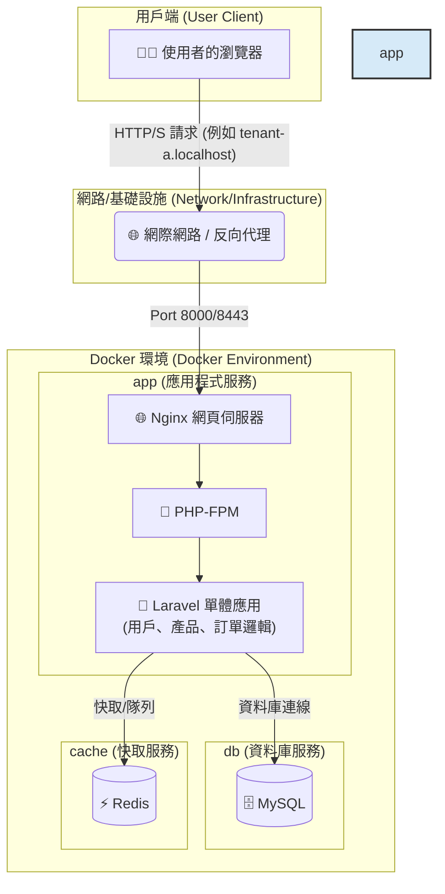
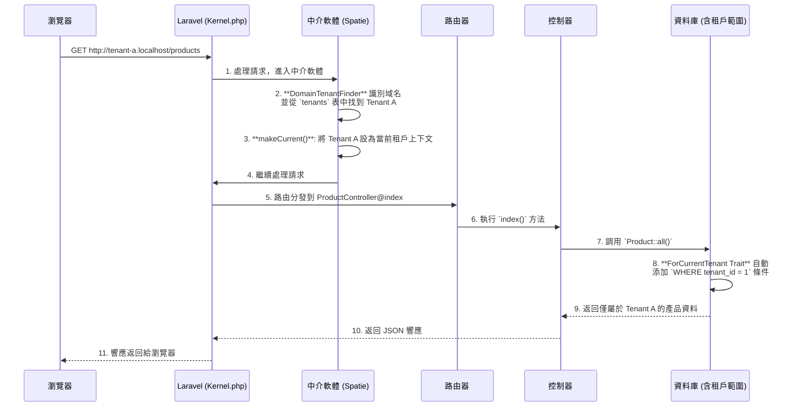

# Laravel 多租戶 SaaS 訂單管理平台樣板

<p align="center">
  
  
  
  
  
</p>

## 🎯 專案目標：一個現代化的多租戶訂單管理平台樣板

這是一個功能齊全、開箱即用的 **多租戶 SaaS 訂單管理平台樣板**。專案旨在為希望快速構建和部署自己訂單系統的企業或開發者，提供一個堅實、可擴展且安全的技術基礎。使用者（租戶）可以註冊自己的獨立帳戶，在完全隔離的環境中管理自己的產品目錄和客戶訂單。

本樣板解決了從零開發 SaaS 平台中最複雜的環節，包括多租戶架構、用戶認證、API 設計、自動化測試和容器化部署。

## ✨ 核心功能

- **無縫多租戶架構**：
  - 採用 `spatie/laravel-multitenancy` 套件，實現單一應用實例服務多個租戶。
  - 透過域名（例如 `tenant-a.localhost`）自動識別租戶，並在資料庫層面實現無縫資料隔離，無需手動添加 `WHERE tenant_id` 條件。

- **API 驅動後端**：
  - 使用 **Laravel Sanctum** 進行輕量級 API Token 認證，支援單頁應用程式 (SPA) 和行動應用程式。
  - 提供完整的 RESTful API 接口，用於用戶認證（註冊、登入、登出）以及**產品（Products）和訂單（Orders）**的 CRUD (Create, Read, Update, Delete) 管理，作為平台的核心業務。

- **現代化前端流程**：
  - 結合 Laravel 的 **Blade 模板引擎**進行高效的伺服器端渲染，並利用 **Vite** 進行極速的前端資產打包、熱重載和開發體驗優化。
  - 提供基礎的登入、註冊、儀表板、產品列表/管理和訂單列表/詳細資訊頁面。

- **自動化 API 文件**：
  - 使用 **Laravel Scribe**，透過程式碼中的 PHPDoc 註解，自動生成專業、可互動的 API 文件，加速開發與協作。
  - 文件可在 `http://localhost:8000/api/docs` 訪問，並支援 Try-It-Out 功能。

- **端到端自動化測試**：
  - 整合 **Playwright** 框架，提供強大且穩定的端到端測試套件，確保應用程式的關鍵使用者流程正常運作。
  - 特別注重驗證多租戶資料隔離、用戶認證及核心訂單/產品管理的可靠性。

- **容器化開發環境**：
  - 提供完整的 **Dockerfile** 和 **docker-compose.yml** 配置，包含 Nginx、PHP-FPM、MySQL 8.0、Redis 7.0 和 Mailpit（郵件捕獲工具）等服務。
  - 實現一鍵啟動和跨平台開發環境的一致性，簡化專案設置。

- **國際化支援 (i18n)**：
  - 預設配置 Laravel 應用程式的時區為 `Asia/Taipei`，並提供繁體中文 (`zh_TW`) 的本地化翻譯檔案，包括驗證訊息、認證訊息和自訂訊息，展示多語言支援的基礎。

## 🛠️ 技術棧

| 類別       | 技術                                                                 |
|------------|----------------------------------------------------------------------|
| **後端**   | PHP 8.2+, Laravel 11, Spatie Laravel Multitenancy, Laravel Sanctum, Laravel Scribe |
| **前端**   | Vite, Blade, Vanilla JavaScript, Tailwind CSS (基礎)                  |
| **資料庫** | MySQL 8.0, Redis 7.0 (Caching & Queues)                              |
| **網頁伺服器** | Nginx                                                            |
| **測試**   | Playwright (E2E), PHPUnit (Unit/Feature)                             |
| **開發工具** | Docker, Docker Compose, Composer, NPM                               |

## 🎯 關於此倉庫

**重要提示**：本倉庫本身不是一個可直接運行的 Laravel 專案。它是一個 SaaS 樣板的「核心程式碼模板」。您需要將這些檔案應用到一個新創建的 Laravel 專案之上，才能構建出一個功能齊全的多租戶訂單管理平台。這種方式的目的是為了清晰地展示所有為實現此 SaaS 樣板而新增或修改的核心程式碼。

## 🚀 快速啟動指南

此流程分為兩大步驟：首先創建一個基礎 Laravel 專案，然後將此倉庫的模板檔案應用進去。

### 步驟一：創建基礎 Laravel 專案

在您的終端機中，使用 Composer 創建一個新的 Laravel 專案。我們將其命名為 `my-saas-app`。

```bash
composer create-project laravel/laravel my-saas-app
```

進入新創建的專案目錄：

```bash
cd my-saas-app
```

### 步驟二：應用 SaaS 樣板模板

將此 GitHub 倉庫的內容複製到您的新專案中，並覆蓋所有同名檔案。

#### 方法 A (推薦): 使用 `git` 和 `rsync`

```bash
# 在 my-saas-app 目錄外，將本倉庫 clone 到一個臨時目錄
git clone https://github.com/BpsEason/laravel_saas_boilerplate.git boilerplate_files

# 使用 rsync 將模板檔案（不含 .git 目錄、.github 目錄等）複製並覆蓋到您的專案中
# 注意：此命令會覆蓋同名文件，請確保您了解其影響。
rsync -av --progress --exclude '.git/' --exclude '.github/' boilerplate_files/ my-saas-app/

# 移除臨時目錄
rm -rf boilerplate_files
```

#### 方法 B (手動):

1. 下載此倉庫的 ZIP 檔案並解壓縮。
2. 將解壓縮後的所有檔案和資料夾，手動複製到您的 `my-saas-app` 目錄中，並在提示時選擇「合併資料夾」和「替換檔案」。

### 步驟三：啟動並運行您的新專案

現在，所有後續操作都在 `my-saas-app` 目錄中進行。

#### 設定環境變數

```bash
cp .env.example .env
```

#### 啟動 Docker 服務 (需要先安裝 Docker 和 Docker Compose)

```bash
docker-compose up -d --build
```

第一次啟動會需要一些時間來構建 Docker 鏡像。

#### 安裝依賴並初始化資料庫

```bash
docker-compose exec app composer install
docker-compose exec app npm install
docker-compose exec app npm run build
docker-compose exec app php artisan key:generate # 生成應用程式金鑰
docker-compose exec app php artisan migrate --seed # 運行資料庫遷移並填充範例資料
```

此步驟會安裝所有後端和前端依賴，並填充範例資料。

#### 設定本地 Hosts 檔案 (可選，但強烈建議)

為了讓多租戶域名正常運作，請將以下內容添加到您的 `hosts` 檔案中：

- **macOS/Linux**: `/etc/hosts`
- **Windows**: `C:\Windows\System32\drivers\etc\hosts`

```plaintext
127.0.0.1 tenant-a.localhost
127.0.0.1 tenant-b.localhost
```

#### 訪問應用程式！🎉

- 🌐 **主要入口**: `http://localhost:8000`
- 👤 **租戶 A 登入**: `http://tenant-a.localhost:8000/login`
- 👤 **租戶 B 登入**: `http://tenant-b.localhost:8000/login`
- 📄 **API 文件 (Scribe)**: `http://localhost:8000/api/docs`

#### 範例使用者 custodian

資料庫填充（seeder）已為您創建了兩個租戶的範例使用者：

- **租戶 A (Tenant A)**:
  - Email: `tenant.a@example.com`
  - Password: `password`
- **租戶 B (Tenant B)**:
  - Email: `tenant.b@example.com`
  - Password: `password`

### ✅ 運行測試

本專案使用 **Playwright** 進行端到端測試，以確保應用程式的穩定性。執行以下命令來運行所有 E2E 測試：

```bash
docker-compose exec app npm run test:e2e
```

若要使用 UI 模式進行調試：

```bash
docker-compose exec app npm run test:e2e:ui
```

## 🏗️ 系統架構：容器化的單體應用

本專案採用 **容器化的單體應用 (Containerized Monolith)** 架構。這是一種現代化且高效的設計模式，將核心的 Laravel 應用程式與其依賴的基礎設施服務（如資料庫、快取）分離，並將它們各自封裝在獨立的 Docker 容器中。這種架構的優勢在於：

- **開發環境一致性**：所有開發者都使用完全相同的環境，解決了「在我機器上可以跑」的問題。
- **部署簡潔**：通過 `docker-compose` 可以一鍵啟動整個應用所需的所有服務。
- **關注點分離**：應用程式邏輯（在 `app` 服務中）與資料持久化（在 `db` 和 `cache` 服務中）清晰分離。
- **可擴展性**：未來可以輕鬆地對 `app` 服務進行水平擴展，以應對更高的流量。



## 🌟 系統亮點與架構解析

這個樣板不僅僅是技術的堆疊，更是一套經過深思熟慮的架構設計。以下是幾個關鍵的設計亮點，展示了本專案如何解決 SaaS 訂單管理平台中的核心挑戰。

### 1. 無縫的多租戶資料隔離

透過 `spatie/laravel-multitenancy`，我們實現了無需在業務程式碼中編寫 `where('tenant_id', ...)` 的無縫資料隔離。

**關鍵程式碼 - `app/Models/Product.php`**:

```php
<?php
namespace App\Models;

use Illuminate\Database\Eloquent\Factories\HasFactory;
use Illuminate\Database\Eloquent\Model;
use Spatie\Multitenancy\Models\Concerns\ForCurrentTenant;

class Product extends Model
{
    // 引入 ForCurrentTenant Trait
    use HasFactory, ForCurrentTenant;
    
    protected $fillable = [
        'tenant_id',
        'user_id',
        'name',
        'description',
        'price',
        'stock',
    ];
}
```

**註解**：僅僅引入 `ForCurrentTenant` Trait，Eloquent 就會自動為所有針對 `Product` 模型（以及 `User` 和 `Order` 模型）的查詢加上 `WHERE tenant_id = ?` 條件。這個 `?` 的值由框架根據當前訪問的域名自動解析。這從根本上杜絕了租戶 A 看到租戶 B 的產品和訂單的風險，確保了資料的嚴格隔離。

### 2. 多租戶請求生命週期

下圖展示了一個來自租戶的請求在 Laravel 應用中的處理流程：



### 3. E2E 測試與頁面物件模型 (POM)

為了確保應用程式的品質，本專案整合了 **Playwright** 進行端到端 (E2E) 測試。對於 SaaS 平台，E2E 測試不僅能驗證核心功能，更能自動化地驗證最關鍵的多租戶資料隔離。為了讓測試程式碼清晰、易於維護，本專案採用了業界推崇的 **頁面物件模型 (Page Object Model, POM)**，將「測試邏輯」與「頁面 UI 互動」分離。

**測試案例 (`tests/e2e/specs/auth.spec.js`)**:

```javascript
import { test, expect } from '@playwright/test';
import LoginPage from '../pages/LoginPage';
import RegisterPage from '../pages/RegisterPage';
import DashboardPage from '../pages/DashboardPage';
import ProductListPage from '../pages/ProductListPage';
import { generateRandomEmail, generateRandomTenantDomain } from '../utils/test-helpers';

test.describe('Authentication and Data Isolation', () => {
    let loginPage;
    let registerPage;
    let dashboardPage;

    test.beforeEach(async ({ page }) => {
        loginPage = new LoginPage(page);
        registerPage = new RegisterPage(page);
        dashboardPage = new DashboardPage(page);
        await page.goto('/');
    });

    test('should allow an existing user to log in and redirect to dashboard', async ({ page }) => {
        await loginPage.navigate();
        await loginPage.login('tenant.a@example.com', 'password');

        await expect(page).toHaveURL(/tenant-a\.localhost:8000\/dashboard/);
        await expect(dashboardPage.welcomeHeading).toBeVisible();
        await expect(dashboardPage.getWelcomeMessage()).resolves.toContain('Dashboard');
    });

    test('should show error for invalid credentials', async ({ page }) => {
        await loginPage.navigate();
        await loginPage.login('invalid@example.com', 'wrongpassword');
        await expect(loginPage.errorMessage).toBeVisible();
        await expect(loginPage.errorMessage).toHaveText(/credentials do not match/i);
    });

    test('should register a new tenant and user', async ({ page }) => {
        await loginPage.goToRegister();

        const randomEmail = generateRandomEmail();
        const tenantName = `TestTenant-${Date.now()}`;
        const tenantDomain = generateRandomTenantDomain();

        await registerPage.register({
            name: 'New User',
            email: randomEmail,
            password: 'password123',
            tenantName: tenantName,
            tenantDomain: tenantDomain
        });

        await expect(page).toHaveURL(new RegExp(tenantDomain.replace('.', '\\.') + '/dashboard'));
        await expect(dashboardPage.welcomeHeading).toBeVisible();
        await expect(dashboardPage.getWelcomeMessage()).resolves.toContain('Dashboard');
    });

    test('should ensure data isolation between tenants', async ({ page }) => {
        // Log in as Tenant A user
        await page.goto('http://tenant-a.localhost:8000/login');
        await loginPage.login('tenant.a@example.com', 'password');
        await dashboardPage.navigate();

        // Simulate creating a product for Tenant A
        const productListPageA = new ProductListPage(page);
        await productListPageA.navbar.goToProducts();
        const tenantAProduct = 'Product_A_' + Date.now();
        await page.locator('#add-product-button').click();
        await page.locator('input[name="name"]').fill(tenantAProduct);
        await page.locator('input[name="price"]').fill('10.00');
        await page.locator('input[name="stock"]').fill('10');
        await page.locator('button[type="submit"]').click();
        await expect(page.locator(`text="${tenantAProduct}"`)).toBeVisible();

        await loginPage.logout();

        // Log in as Tenant B user
        await page.goto('http://tenant-b.localhost:8000/login');
        await loginPage.login('tenant.b@example.com', 'password');
        await dashboardPage.navigate();

        // Navigate to products list for Tenant B
        const productListPageB = new ProductListPage(page);
        await productListPageB.navbar.goToProducts();

        // Assert that the product from Tenant A is NOT visible in Tenant B's context
        await expect(page.locator(`text="${tenantAProduct}"`)).not.toBeVisible();
    });
});
```

**頁面物件 (`tests/e2e/pages/LoginPage.js`)**:

```javascript
import BasePage from './BasePage';
import { expect } from '@playwright/test';

class LoginPage extends BasePage {
    constructor(page) {
        super(page);
        this.emailInput = page.locator('input[type="email"]');
        this.passwordInput = page.locator('input[type="password"]');
        this.loginButton = page.locator('button[type="submit"]');
        this.registerLink = page.locator('a[href="/register"]');
        this.errorMessage = page.locator('.error-message');
    }

    async navigate() {
        await super.navigate('/login');
        await expect(this.loginButton).toBeVisible();
    }

    async login(email, password) {
        await this.emailInput.fill(email);
        await this.passwordInput.fill(password);
        await this.loginButton.click();
    }

    async goToRegister() {
        await this.registerLink.click();
        await this.page.waitForURL(/register/);
    }

    async getErrorMessage() {
        await expect(this.errorMessage).toBeVisible();
        return this.errorMessage.textContent();
    }
}

export default LoginPage;
```

**優勢**：如果未來登入頁面的設計變更（例如輸入框的 `id` 改變），只需要修改 `LoginPage.js`，所有使用到登入功能的測試案例都不需變動，極大提升了測試的可維護性。

## 🚀 第二優先級：自動化與 CI/CD

展示您會寫程式碼是一回事，展示您會自動化地構建和測試軟體則是另一回事，後者更能體現資深開發者的價值。本專案整合了 **GitHub Actions** 以確保每次程式碼提交都能自動被驗證。

### GitHub Actions (CI/CD)

在專案根目錄下創建 `.github/workflows/ci.yml`。這個 CI 工作流程將負責：

- **程式碼檢出**：檢出最新的程式碼。
- **環境準備**：確保所有 Docker 服務啟動並準備就緒。
- **依賴安裝**：執行 Composer 和 NPM 依賴安裝。
- **資料庫初始化**：運行資料庫遷移和填充範例資料。
- **執行測試**：運行 PHPUnit 單元/功能測試（如果有的話）和 Playwright E2E 測試。
- **生成報告**：生成詳細的測試報告（例如 Allure Report）。

**.github/workflows/ci.yml 範例**:

```yaml
name: CI Pipeline

on:
  push:
    branches: [ main ]
  pull_request:
    branches: [ main ]

jobs:
  build-and-test:
    runs-on: ubuntu-latest

    steps:
      - name: Checkout code
        uses: actions/checkout@v3

      - name: Set up Docker Compose environment
        run: |
          mkdir -p my-saas-app
          cp -r . my-saas-app/
          cd my-saas-app
          cp .env.example .env
          docker-compose up -d --build --wait

      - name: Install dependencies and initialize database
        working-directory: ./my-saas-app
        run: |
          docker-compose exec app composer install
          docker-compose exec app npm install
          docker-compose exec app npm run build
          docker-compose exec app php artisan key:generate
          docker-compose exec app php artisan migrate --seed

      - name: Run Playwright E2E tests
        working-directory: ./my-saas-app
        run: |
          docker-compose exec app npx playwright install --with-deps
          docker-compose exec app npm run test:e2e
```

**優勢**：當您推送程式碼到 GitHub 時，Actions 會自動運行，並在您的 Pull Request 上顯示一個綠色的勾。這無聲地告訴面試官：「我的專案不僅能跑，而且有自動化流程來保證它的品質。」

## 🛠️ 第三優先級：程式碼與架構重構

您的程式碼已經很好了，但可以通過一些重構來展示對「關注點分離」和「Laravel 最佳實踐」的深入理解。

### 1. 使用 Laravel Form Requests 進行驗證

**改進方案**：不要在 Controller 方法中直接調用 `$request->validate()`。創建專門的 **Form Request** 類來處理驗證邏輯。

**範例 (`app/Http/Requests/StoreProductRequest.php`)**:

```php
<?php

namespace App\Http\Requests;

use Illuminate\Foundation\Http\FormRequest;
use Illuminate\Support\Facades\Auth;

class StoreProductRequest extends FormRequest
{
    public function authorize(): bool
    {
        return Auth::check();
    }

    public function rules(): array
    {
        return [
            'name' => ['required', 'string', 'max:255'],
            'description' => ['nullable', 'string'],
            'price' => ['required', 'numeric', 'min:0'],
            'stock' => ['required', 'integer', 'min:0'],
        ];
    }

    public function messages(): array
    {
        return [
            'price.min' => '產品價格不能為負數。',
            'stock.min' => '產品庫存不能為負數。',
        ];
    }
}
```

**控制器中的使用 (`app/Http/Controllers/Api/V1/ProductController.php`)**:

```php
<?php

namespace App\Http\Controllers\Api\V1;

use App\Http\Controllers\Controller;
use App\Http\Requests\StoreProductRequest;
use App\Http\Requests\UpdateProductRequest;
use App\Models\Product;
use App\Http\Resources\ProductResource;
use Illuminate\Support\Facades\Auth;

class ProductController extends Controller
{
    public function store(StoreProductRequest $request)
    {
        $product = Auth::user()->products()->create($request->validated());
        return new ProductResource($product);
    }

    public function update(UpdateProductRequest $request, Product $product)
    {
        if ($product->user_id !== Auth::id()) {
            abort(403, '您沒有權限更新此產品。');
        }

        $product->update($request->validated());
        return new ProductResource($product);
    }

    public function destroy(Product $product)
    {
        if ($product->user_id !== Auth::id()) {
            throw ValidationException::withMessages([
                'product' => ['您沒有權限刪除此產品。'],
            ])->status(403);
        }

        $product->delete();
        return response()->json(['status' => 'success', 'message' => '產品已成功刪除。']);
    }
}
```

**好處**：這讓控制器變得乾淨，只專注於核心業務邏輯。驗證和授權邏輯被移到專門的類中，遵循了單一職責原則 (SRP)，提升程式碼可讀性、可維護性和可測試性。

### 2. 將業務邏輯從控制器中抽離 (Action/Service 層)

**改進方案**：`OrderController@store` 方法中包含檢查庫存、計算總價等邏輯，將這些封裝到獨立的 **Action** 或 **Service** 類中。

**範例 (`app/Actions/Orders/CreateOrderAction.php`)**:

```php
<?php

namespace App\Actions\Orders;

use App\Models\Order;
use App\Models\OrderItem;
use App\Models\Product;
use App\Models\User;
use Illuminate\Support\Facades\DB;
use Illuminate\Validation\ValidationException;

class CreateOrderAction
{
    public function execute(User $user, array $orderData, array $itemsData): Order
    {
        $totalAmount = 0;
        $orderItemsToSave = [];

        DB::beginTransaction();
        try {
            foreach ($itemsData as $item) {
                $product = Product::find($item['product_id']);
                if (!$product || $product->user_id !== $user->id) {
                    throw ValidationException::withMessages([
                        'items' => ["產品 ID {$item['product_id']} 不存在或您無權訪問。"],
                    ])->status(400);
                }

                if ($product->stock < $item['quantity']) {
                    throw ValidationException::withMessages([
                        'items' => ["產品 '{$product->name}' 庫存不足。目前庫存: {$product->stock}, 需求數量: {$item['quantity']}"],
                    ])->status(400);
                }

                $product->decrement('stock', $item['quantity']);
                $totalAmount += $product->price * $item['quantity'];
                $orderItemsToSave[] = new OrderItem([
                    'product_id' => $product->id,
                    'quantity' => $item['quantity'],
                    'price_per_unit' => $product->price,
                ]);
            }

            $order = $user->orders()->create(array_merge($orderData, [
                'total_amount' => $totalAmount,
                'status' => 'pending',
            ]));

            $order->items()->saveMany($orderItemsToSave);
            DB::commit();
            return $order->load('items.product');
        } catch (\Exception $e) {
            DB::rollBack();
            throw $e;
        }
    }
}
```

**控制器中的使用 (`app/Http/Controllers/Api/V1/OrderController.php`)**:

```php
<?php

namespace App\Http\Controllers\Api\V1;

use App\Http\Controllers\Controller;
use App\Http\Requests\StoreOrderRequest;
use App\Actions\Orders\CreateOrderAction;
use App\Http\Resources\OrderResource;
use Illuminate\Support\Facades\Auth;

class OrderController extends Controller
{
    public function store(StoreOrderRequest $request, CreateOrderAction $createOrderAction)
    {
        $order = $createOrderAction->execute(
            Auth::user(),
            $request->only('customer_name'),
            $request->input('items')
        );
        return new OrderResource($order);
    }
}
```

**好處**：遵循單一職責原則，讓控制器更輕量，複雜邏輯封裝在獨立的類中，易於測試和複用。

## ✨ 第四優先級：用戶體驗與細節

讓生成的專案看起來更像一個真實的產品。

### 1. 引入 Tailwind CSS 配置與 UI 元件庫

**改進方案**：正式引入 `tailwind.config.js` 和 `postcss.config.js`，並考慮使用基於 Tailwind 的 UI 元件庫（如 Headless UI 或 DaisyUI）。

**`tailwind.config.js` 範例**:

```javascript
/** @type {import('tailwindcss').Config} */
export default {
  content: [
    './resources/**/*.blade.php',
    './resources/**/*.js',
    './resources/**/*.vue',
  ],
  theme: {
    extend: {
      fontFamily: {
        sans: ['Inter', 'sans-serif'],
      },
      colors: {
        primary: '#3490dc',
        secondary: '#6cb2eb',
      }
    },
  },
  plugins: [
    require('@tailwindcss/forms'),
  ],
};
```

**`postcss.config.js` 範例**:

```javascript
export default {
  plugins: {
    tailwindcss: {},
    autoprefixer: {},
  },
};
```

**優勢**：Tailwind CSS 提供強大的工具類來快速構建響應式設計，UI 元件庫可加速前端開發並確保一致的視覺風格。

### 2. 改善 JS 互動：替換 `confirm()` 和 `alert()`

**改進方案**：將 `confirm()` 和 `alert()` 替換為更現代的 **SweetAlert2** 或自訂 Modal 元件。

**範例 (使用 SweetAlert2)**:

```javascript
import Swal from 'sweetalert2';

async function handleDeleteProduct(productId) {
    const result = await Swal.fire({
        title: '確定要刪除嗎？',
        text: '此操作將無法復原！',
        icon: 'warning',
        showCancelButton: true,
        confirmButtonColor: '#3085d6',
        cancelButtonColor: '#d33',
        confirmButtonText: '是的，刪除它！',
        cancelButtonText: '取消'
    });

    if (result.isConfirmed) {
        try {
            const response = await fetch(`/api/v1/products/${productId}`, {
                method: 'DELETE',
                headers: {
                    'Accept': 'application/json',
                    'Authorization': `Bearer ${localStorage.getItem('authToken')}`
                }
            });
            
            if (response.ok) {
                Swal.fire('已刪除！', '產品已成功刪除。', 'success');
            } else {
                const errorData = await response.json();
                Swal.fire('錯誤！', errorData.message || '刪除產品失敗。', 'error');
            }
        } catch (error) {
            console.error('Error deleting product:', error);
            Swal.fire('錯誤！', '連線 API 刪除產品失敗。', 'error');
        }
    }
}
```

**優勢**：提供更友善、更具品牌一致性的使用者互動體驗，並改善錯誤提示。

## ❓ 常見問題與設計決策

### Q1: 這個專案的目標是什麼？它解決了什麼問題？

**A**: 這是一個基於 Laravel 的多租戶 SaaS 訂單管理平台樣板，旨在為開發者提供一個開箱即用、功能齊全的基礎架構，讓他們能快速啟動自己的 SaaS 產品。它解決了從頭構建 SaaS 平台時，重複且耗時的基礎架構配置問題，讓開發者更專注於核心業務邏輯。

### Q2: 為什麼選擇多租戶架構？它是如何實現資料隔離的？

**A**: 多租戶架構實現資源高效利用和集中管理，降低運營成本。使用 `spatie/laravel-multitenancy` 套件，透過 `DomainTenantFinder` 根據域名識別租戶，並使用 `Tenant::makeCurrent()` 設置全局上下文。`ForCurrentTenant` Trait 自動為模型查詢添加 `WHERE tenant_id = ?` 條件，確保資料隔離。

### Q3: 為什麼選擇 Laravel Sanctum 進行 API 認證？

**A**: Sanctum 專為 SPA 和行動應用程式設計，使用輕量級 API Token 認證，適合前後端分離架構，同時提供 CSRF 保護，兼顧安全性和靈活性。

### Q4: Docker 在這個專案中扮演了什麼角色？

**A**: Docker 提供一致的開發和部署環境，將應用程式及其依賴封裝在容器中，確保跨平台一致性，簡化依賴管理和部署流程。

## 📜 授權

此專案採用 **MIT License** 授權。
