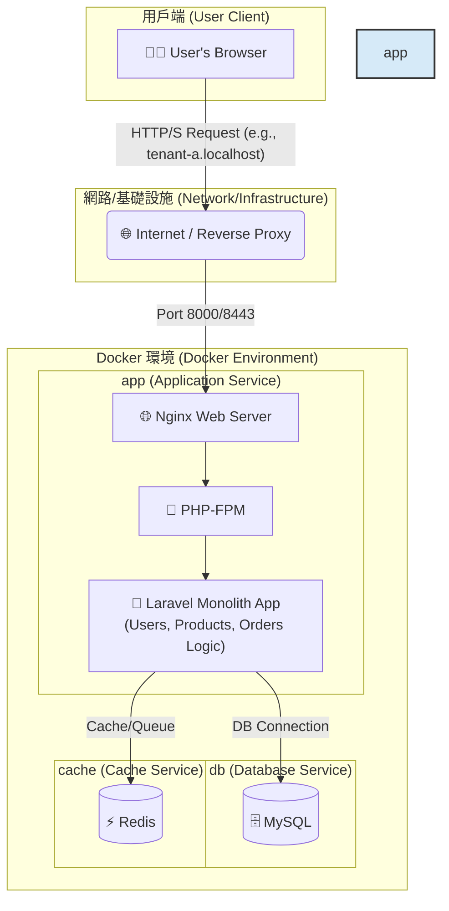
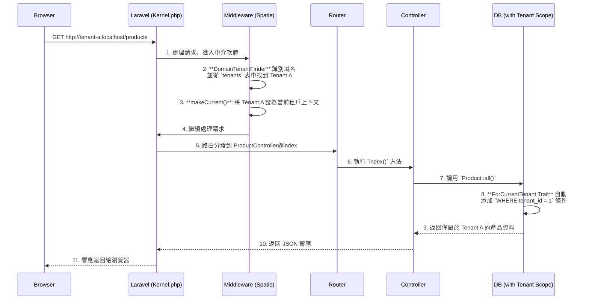

# Laravel Multi-Tenant SaaS Boilerplate for Order Management


<p align="center">
  
  
  
  
  
  <a href="https://github.com/BpsEason/laravel_saas_boilerplate/actions/workflows/ci.yml">
    
  </a>
</p>

## 🎯 專案目標：一個現代化的多租戶訂單管理平台

這是一個功能齊全、開箱即用的 **多租戶 SaaS 訂單管理平台樣板 (Boilerplate)**。專案旨在為希望快速構建和部署自己訂單系統的企業或開發者，提供一個堅實、可擴展且安全的技術基礎。

使用者（租戶）可以註冊自己的獨立帳戶，在完全隔離的環境中管理自己的**產品目錄**和**客戶訂單**。本樣板解決了從零開發 SaaS 平台中最複雜的環節，包括多租戶架構、用戶認證、API 設計、自動化測試和容器化部署。

## ✨ 核心功能 (Core Features)

-   **多租戶架構 (Multi-Tenancy)**: 每個租戶擁有獨立的產品和訂單資料，透過 `spatie/laravel-multitenancy` 實現域名級別的無縫資料隔離。
-   **訂單與產品管理**: 提供完整的產品（Products）和訂單（Orders）的 CRUD 功能，作為平台的核心業務。
-   **API 驅動後端 (API-Driven)**: 使用 `Laravel Sanctum` 進行認證，所有業務邏輯都通過一套 RESTful API 實現。
-   **自動化 API 文件 (Scribe)**: 自動從程式碼註解生成專業、可互動的 API 文件。
-   **端到端自動化測試 (Playwright)**: 包含完整的 E2E 測試套件，覆蓋註冊、登入、訂單創建和租戶資料隔離等關鍵流程。
-   **容器化開發環境 (Docker)**: 提供一個包含 Nginx, PHP-FPM, MySQL, 和 Redis 的完整 Docker 環境，實現一鍵啟動。
-   **現代化前端流程 (Vite)**: 使用 Vite 進行前端資源打包，提供極速的開發體驗。

## 🚀 快速啟動 (Quick Start)

請確保您的系統已安裝 `Docker` 和 `Docker Compose`。

1.  **複製儲存庫**
    ```bash
    git clone https://github.com/BpsEason/laravel_saas_boilerplate.git
    cd laravel_saas_boilerplate
    ```

2.  **設定環境變數**
    ```bash
    cp .env.example .env
    ```

3.  **啟動 Docker 服務**
    ```bash
    docker-compose up -d --build
    ```
    *第一次啟動會需要一些時間來構建 Docker 鏡像。*

4.  **安裝依賴並初始化資料庫**
    ```bash
    docker-compose exec app composer install
    docker-compose exec app npm install
    docker-compose exec app npm run build
    docker-compose exec app php artisan migrate --seed
    ```
    *此步驟會安裝所有後端和前端依賴，並填充範例資料。*

5.  **設定本地 Hosts 檔案** (可選，但強烈建議)
    為了讓多租戶域名正常運作，請將以下內容添加到您的 `hosts` 檔案中：
    -   macOS/Linux: `/etc/hosts`
    -   Windows: `C:\Windows\System32\drivers\etc\hosts`

    ```
    127.0.0.1 tenant-a.localhost
    127.0.0.1 tenant-b.localhost
    ```

6.  **訪問應用程式！🎉**
    -   🌐 **主要入口**: [http://localhost:8000](http://localhost:8000)
    -   👤 **租戶 A**: [http://tenant-a.localhost:8000/login](http://tenant-a.localhost:8000/login)
    -   👤 **租戶 B**: [http://tenant-b.localhost:8000/login](http://tenant-b.localhost:8000/login)
    -   📄 **API 文件 (Scribe)**: [http://localhost:8000/api/docs](http://localhost:8000/api/docs)

### 範例使用者帳號

資料庫填充（seeder）已為您創建了兩個租戶的範例使用者：

-   **租戶 A (Tenant A)**:
    -   Email: `tenant.a@example.com`
    -   Password: `password`
-   **租戶 B (Tenant B)**:
    -   Email: `tenant.b@example.com`
    -   Password: `password`

## ✅ 運行測試 (Running Tests)

本專案使用 Playwright 進行端到端測試，以確保應用程式的穩定性。

執行以下命令來運行所有 E2E 測試：
```bash
docker-compose exec app npm run test:e2e
```
若要使用 UI 模式進行調試：
```bash
docker-compose exec app npm run test:e2e:ui
```

## 🏗️ 系統架構：容器化的單體應用

本專案採用 **容器化的單體應用 (Containerized Monolith)** 架構。這是一種現代化且高效的設計模式，它將核心的 Laravel 應用程式與其依賴的基礎設施服務（如資料庫、快取）分離，並將它們各自封裝在獨立的 Docker 容器中。



## 🌟 系統亮點與架構解析

這個樣板不僅僅是技術的堆疊，更是一套經過深思熟慮的架構設計。以下是幾個關鍵的設計亮點，展示了本專案如何解決 SaaS 訂單管理平台中的核心挑戰。

### 1. 無縫的多租戶資料隔離

透過 `spatie/laravel-multitenancy`，我們實現了無需在業務程式碼中編寫 `where('tenant_id', ...)` 的無縫資料隔離。

**關鍵程式碼 - `app/Models/Product.php`:**
```php
<?php
namespace App\Models;

use Spatie\Multitenancy\Models\Concerns\ForCurrentTenant;

class Product extends Model
{
    use HasFactory, ForCurrentTenant; // 引入 ForCurrentTenant Trait
    // ...
}
```
-   **註解**：僅僅引入 `ForCurrentTenant` Trait，Eloquent 就會自動為所有查詢加上 `WHERE tenant_id = ?` 條件，從根本上杜絕了資料洩露的風險。

### 2. 多租戶請求生命週期

下圖展示了一個來自租戶的請求在 Laravel 應用中的處理流程：


## ❓ 常見問題與設計決策 (FAQ & Design Decisions)

**Q1: 這個專案適合什麼樣的使用者？**
> **A:** 任何需要快速搭建一個獨立、安全後台來管理自有產品和客戶訂單的中小型企業、電商賣家或獨立開發者。

**Q2: 為什麼選擇 Spatie 的多租戶套件，而不是自己實現？**
> **A:** Spatie 的套件經過社群大量驗證，能穩定地處理複雜的任務切換（資料庫、快取、隊列等），讓我們能專注於業務邏輯。這是遵循「不重複造輪子」的最佳工程實踐。

**Q3: 我可以在此基礎上擴展功能嗎？例如加入支付或發貨功能？**
> **A:** 當然可以！這正是此樣板的核心價值。它提供了一個穩固的骨架，您可以非常容易地在此基礎上增加新功能，如整合 Stripe 支付、串接物流 API 等。

**Q4: 這個專案在部署到生產環境時，還需要考慮哪些優化？**
> **A:** 在正式上線前，建議進行以下優化：
> -   **安全性強化**: 配置真實的 HTTPS 憑證、設定更嚴格的 API 速率限制。
> -   **性能優化**: 啟用 Laravel 的配置和路由快取，並對資料庫查詢進行優化。
> -   **監控與日誌**: 整合 Sentry 或 Laravel Telescope 等工具進行性能監控和錯誤追蹤。
> -   **備份策略**: 制定並實施定期的資料庫自動備份和恢復計劃。

## 📜 授權 (License)

此專案採用 [MIT License](LICENSE.md) 授權。
