# Laravel 多租戶 SaaS 訂單管理平台樣板

<p align="center">
  
  
  
  
  
</p>

## 🎯 專案目標：一個現代化的多租戶訂單管理平台樣板

這是一個功能齊全、開箱即用的 **多租戶 SaaS 訂單管理平台樣板**。專案旨在為希望快速構建和部署自己訂單系統的企業或開發者，提供一個堅實、可擴展且安全的技術基礎。使用者（租戶）可以註冊自己的獨立帳戶，在完全隔離的環境中管理自己的產品目錄和客戶訂單。

本樣板解決了從零開發 SaaS 平台中最複雜的環節，包括多租戶架構、用戶認證、API 設計、自動化測試和容器化部署。

## ✨ 核心功能

- **無縫多租戶架構**：
  - 採用 `spatie/laravel-multitenancy` 套件，實現單一應用實例服務多個租戶。
  - 透過域名（例如 `tenant-a.localhost`）自動識別租戶，並在資料庫層面實現無縫資料隔離，無需手動添加 `WHERE tenant_id` 條件。

- **API 驅動後端**：
  - 使用 **Laravel Sanctum** 進行輕量級 API Token 認證，支援單頁應用程式 (SPA) 和行動應用程式。
  - 提供完整的 RESTful API 接口，用於用戶認證（註冊、登入、登出）以及**產品（Products）和訂單（Orders）**的 CRUD (Create, Read, Update, Delete) 管理，作為平台的核心業務。

- **現代化前端流程**：
  - 結合 Laravel 的 **Blade 模板引擎**進行高效的伺服器端渲染，並利用 **Vite** 進行極速的前端資產打包、熱重載和開發體驗優化。
  - 提供基礎的登入、註冊、儀表板、產品列表/管理和訂單列表/詳細資訊頁面。

- **自動化 API 文件**：
  - 使用 **Laravel Scribe**，透過程式碼中的 PHPDoc 註解，自動生成專業、可互動的 API 文件，加速開發與協作。
  - 文件可在 `http://localhost:8000/api/docs` 訪問，並支援 Try-It-Out 功能。

- **端到端自動化測試**：
  - 整合 **Playwright** 框架，提供強大且穩定的端到端測試套件，確保應用程式的關鍵使用者流程正常運作。
  - 特別注重驗證多租戶資料隔離、用戶認證及核心訂單/產品管理的可靠性。

- **容器化開發環境**：
  - 提供完整的 **Dockerfile** 和 **docker-compose.yml** 配置，包含 Nginx、PHP-FPM、MySQL 8.0、Redis 7.0 和 Mailpit（郵件捕獲工具）等服務。
  - 實現一鍵啟動和跨平台開發環境的一致性，簡化專案設置。

- **國際化支援 (i18n)**：
  - 預設配置 Laravel 應用程式的時區為 `Asia/Taipei`，並提供繁體中文 (`zh_TW`) 的本地化翻譯檔案，包括驗證訊息、認證訊息和自訂訊息，展示多語言支援的基礎。

## 🛠️ 技術棧

| 類別       | 技術                                                                 |
|------------|----------------------------------------------------------------------|
| **後端**   | PHP 8.2+, Laravel 11, Spatie Laravel Multitenancy, Laravel Sanctum, Laravel Scribe |
| **前端**   | Vite, Blade, Vanilla JavaScript, Tailwind CSS (基礎)                  |
| **資料庫** | MySQL 8.0, Redis 7.0 (Caching & Queues)                              |
| **網頁伺服器** | Nginx                                                            |
| **測試**   | Playwright (E2E), PHPUnit (Unit/Feature)                             |
| **開發工具** | Docker, Docker Compose, Composer, NPM                               |

## 🎯 關於此倉庫

**重要提示**：本倉庫本身不是一個可直接運行的 Laravel 專案。它是一個 SaaS 樣板的「核心程式碼模板」。您需要將這些檔案應用到一個新創建的 Laravel 專案之上，才能構建出一個功能齊全的多租戶訂單管理平台。這種方式的目的是為了清晰地展示所有為實現此 SaaS 樣板而新增或修改的核心程式碼。

## 🚀 快速啟動指南

此流程分為兩大步驟：首先創建一個基礎 Laravel 專案，然後將此倉庫的模板檔案應用進去。

### 步驟一：創建基礎 Laravel 專案

在您的終端機中，使用 Composer 創建一個新的 Laravel 專案。我們將其命名為 `my-saas-app`。

```bash
composer create-project laravel/laravel my-saas-app
```

進入新創建的專案目錄：

```bash
cd my-saas-app
```

### 步驟二：應用 SaaS 樣板模板

將此 GitHub 倉庫的內容複製到您的新專案中，並覆蓋所有同名檔案。

#### 方法 A (推薦): 使用 `git` 和 `rsync`

```bash
# 在 my-saas-app 目錄外，將本倉庫 clone 到一個臨時目錄
git clone https://github.com/BpsEason/laravel_saas_boilerplate.git boilerplate_files

# 使用 rsync 將模板檔案（不含 .git 目錄、.github 目錄等）複製並覆蓋到您的專案中
# 注意：此命令會覆蓋同名文件，請確保您了解其影響。
rsync -av --progress --exclude '.git/' --exclude '.github/' boilerplate_files/ my-saas-app/

# 移除臨時目錄
rm -rf boilerplate_files
```

#### 方法 B (手動):

1. 下載此倉庫的 ZIP 檔案並解壓縮。
2. 將解壓縮後的所有檔案和資料夾，手動複製到您的 `my-saas-app` 目錄中，並在提示時選擇「合併資料夾」和「替換檔案」。

### 步驟三：啟動並運行您的新專案

現在，所有後續操作都在 `my-saas-app` 目錄中進行。

#### 設定環境變數

```bash
cp .env.example .env
```

#### 啟動 Docker 服務 (需要先安裝 Docker 和 Docker Compose)

```bash
docker-compose up -d --build
```

第一次啟動會需要一些時間來構建 Docker 鏡像。

#### 安裝依賴並初始化資料庫

```bash
docker-compose exec app composer install
docker-compose exec app npm install
docker-compose exec app npm run build
docker-compose exec app php artisan key:generate # 生成應用程式金鑰
docker-compose exec app php artisan migrate --seed # 運行資料庫遷移並填充範例資料
```

此步驟會安裝所有後端和前端依賴，並填充範例資料。

#### 設定本地 Hosts 檔案 (可選，但強烈建議)

為了讓多租戶域名正常運作，請將以下內容添加到您的 `hosts` 檔案中：

- **macOS/Linux**: `/etc/hosts`
- **Windows**: `C:\Windows\System32\drivers\etc\hosts`

```plaintext
127.0.0.1 tenant-a.localhost
127.0.0.1 tenant-b.localhost
```

#### 訪問應用程式！🎉

- 🌐 **主要入口**: `http://localhost:8000`
- 👤 **租戶 A 登入**: `http://tenant-a.localhost:8000/login`
- 👤 **租戶 B 登入**: `http://tenant-b.localhost:8000/login`
- 📄 **API 文件 (Scribe)**: `http://localhost:8000/api/docs`

#### 範例使用者帳號

資料庫填充（seeder）已為您創建了兩個租戶的範例使用者：

- **租戶 A (Tenant A)**:
  - Email: `tenant.a@example.com`
  - Password: `password`
- **租戶 B (Tenant B)**:
  - Email: `tenant.b@example.com`
  - Password: `password`

### ✅ 運行測試

本專案使用 **Playwright** 進行端到端測試，以確保應用程式的穩定性。執行以下命令來運行所有 E2E 測試：

```bash
docker-compose exec app npm run test:e2e
```

若要使用 UI 模式進行調試：

```bash
docker-compose exec app npm run test:e2e:ui
```

## 🏗️ 系統架構：容器化的單體應用

本專案採用 **容器化的單體應用 (Containerized Monolith)** 架構。這是一種現代化且高效的設計模式，將核心的 Laravel 應用程式與其依賴的基礎設施服務（如資料庫、快取）分離，並將它們各自封裝在獨立的 Docker 容器中。這種架構的優勢在於：

- **開發環境一致性**：所有開發者都使用完全相同的環境，解決了「在我機器上可以跑」的問題。
- **部署簡潔**：通過 `docker-compose` 可以一鍵啟動整個應用所需的所有服務。
- **關注點分離**：應用程式邏輯（在 `app` 服務中）與資料持久化（在 `db` 和 `cache` 服務中）清晰分離。
- **可擴展性**：未來可以輕鬆地對 `app` 服務進行水平擴展，以應對更高的流量。

```mermaid
graph TD
    subgraph "用戶端 (User Client)"
        U[👨‍💻 使用者的瀏覽器]
    end

    subgraph "網路/基礎設施 (Network/Infrastructure)"
        LB(🌐 網際網路 / 反向代理)
    end

    subgraph "Docker 環境 (Docker Environment)"
        direction LR
        subgraph "app (應用程式服務)"
            style app fill:#D6EAF8,stroke:#333,stroke-width:2px
            direction TB
            Nginx[🌐 Nginx 網頁伺服器] --> FPM[🐘 PHP-FPM]
            FPM --> LV["🚀 Laravel 單體應用<br/>(用戶、產品、訂單邏輯)"]
        end

        subgraph "db (資料庫服務)"
            DB[(🗄️ MySQL)]
        end

        subgraph "cache (快取服務)"
            Redis[(⚡ Redis)]
        end
    end
    
    U -- "HTTP/S 請求 (例如 tenant-a.localhost)" --> LB
    LB -- "Port 8000/8443" --> Nginx

    LV -- "資料庫連線" --> DB
    LV -- "快取/隊列" --> Redis
```



## 🌟 系統亮點與架構解析

這個樣板不僅僅是技術的堆疊，更是一套經過深思熟慮的架構設計。以下是幾個關鍵的設計亮點，展示了本專案如何解決 SaaS 訂單管理平台中的核心挑戰。

### 1. 無縫的多租戶資料隔離

透過 `spatie/laravel-multitenancy`，我們實現了無需在業務程式碼中編寫 `where('tenant_id', ...)` 的無縫資料隔離。

**關鍵程式碼 - `app/Models/Product.php`**:

```php
<?php
namespace App\Models;

use Illuminate\Database\Eloquent\Factories\HasFactory;
use Illuminate\Database\Eloquent\Model;
use Spatie\Multitenancy\Models\Concerns\ForCurrentTenant;

class Product extends Model
{
    // 引入 ForCurrentTenant Trait，自動為查詢添加租戶範圍
    use HasFactory, ForCurrentTenant;
    
    // 可填充的欄位，確保模型能正確處理表單數據
    protected $fillable = [
        'tenant_id',
        'user_id',
        'name',
        'description',
        'price',
        'stock',
    ];
}
```

**註解**：僅僅引入 `ForCurrentTenant` Trait，Eloquent 就會自動為所有針對 `Product` 模型（以及 `User` 和 `Order` 模型）的查詢加上 `WHERE tenant_id = ?` 條件。這個 `?` 的值由框架根據當前訪問的域名自動解析。這從根本上杜絕了租戶 A 看到租戶 B 的產品和訂單的風險，確保了資料的嚴格隔離。

### 2. 多租戶請求生命週期

下圖展示了一個來自租戶的請求在 Laravel 應用中的處理流程：

```mermaid
sequenceDiagram
    participant B as 瀏覽器
    participant L as Laravel (Kernel.php)
    participant M as 中介軟體 (Spatie)
    participant R as 路由器
    participant C as 控制器
    participant D as 資料庫 (含租戶範圍)

    B->>L: GET http://tenant-a.localhost/products
    L->>M: 1. 處理請求，進入中介軟體
    M->>M: 2. **DomainTenantFinder** 識別域名<br/>並從 `tenants` 表中找到 Tenant A
    M->>M: 3 | **makeCurrent()**: 將 Tenant A 設為當前租戶上下文
    M->>L: 4. 繼續處理請求
    L->>R: 5. 路由分發到 ProductController@index
    R->>C: 6. 執行 `index()` 方法
    C->>D: 7. 調用 `Product::all()`
    D->>D: 8. **ForCurrentTenant Trait** 自動<br/>添加 `WHERE tenant_id = 1` 條件
    D-->>C: 9. 返回僅屬於 Tenant A 的產品資料
    C-->>L: 10. 返回 JSON 響應
    L-->>B: 11. 響應返回給瀏覽器
```



### 3. E2E 測試與頁面物件模型 (POM)

為了確保應用程式的品質，本專案整合了 **Playworm** 進行端到端 (E2E) 測試。對於 SaaS 平台，E2E 測試不僅能驗證核心功能，更能自動化地驗證最關鍵的多租戶資料隔離。為了讓測試程式碼清晰、易於維護，本專案採用了業界推崇的 **頁面物件模型 (Page Object Model, POM)**，將「測試邏輯」與「頁面 UI 互動」分離。

**測試案例 (`tests/e2e/specs/auth.spec.js`)**:

```javascript
import { test, expect } from '@playwright/test';
import LoginPage from '../pages/LoginPage';
import RegisterPage from '../pages/RegisterPage'; // 新增: RegisterPage
import DashboardPage from '../pages/DashboardPage';
import ProductListPage from '../pages/ProductListPage'; // 用於資料隔離測試
import { generateRandomEmail, generateRandomTenantDomain } from '../utils/test-helpers'; // 更新引入

test.describe('Authentication and Data Isolation', () => {
    let loginPage;
    let registerPage;
    let dashboardPage;

    test.beforeEach(async ({ page }) => {
        loginPage = new LoginPage(page);
        registerPage = new RegisterPage(page);
        dashboardPage = new DashboardPage(page);
        await page.goto('/'); // 從基礎 URL 開始
    });

    test('should allow an existing user to log in and redirect to dashboard', async ({ page }) => {
        await loginPage.navigate();
        await loginPage.login('tenant.a@example.com', 'password');

        await expect(page).toHaveURL(/tenant-a\.localhost:8000\/dashboard/);
        await expect(dashboardPage.welcomeHeading).toBeVisible();
        await expect(dashboardPage.getWelcomeMessage()).resolves.toContain('Dashboard');
    });

    test('should show error for invalid credentials', async ({ page }) => {
        await loginPage.navigate();
        await loginPage.login('invalid@example.com', 'wrongpassword');
        await expect(loginPage.errorMessage).toBeVisible();
        await expect(loginPage.errorMessage).toHaveText(/credentials do not match/i);
    });

    test('should register a new tenant and user', async ({ page }) => {
        await loginPage.goToRegister();

        const randomEmail = generateRandomEmail();
        const tenantName = `TestTenant-${Date.now()}`;
        const tenantDomain = generateRandomTenantDomain();

        await registerPage.register({
            name: 'New User',
            email: randomEmail,
            password: 'password123',
            tenantName: tenantName,
            tenantDomain: tenantDomain
        });

        await expect(page).toHaveURL(new RegExp(tenantDomain.replace('.', '\\.') + '/dashboard'));
        await expect(dashboardPage.welcomeHeading).toBeVisible();
        await expect(dashboardPage.getWelcomeMessage()).resolves.toContain('Dashboard');
    });

    test('should ensure data isolation between tenants', async ({ page }) => {
        // 以 Tenant A 用戶身份登入
        await page.goto('http://tenant-a.localhost:8000/login');
        await loginPage.login('tenant.a@example.com', 'password');
        await dashboardPage.navigate();

        // 模擬為 Tenant A 創建產品
        const productListPageA = new ProductListPage(page);
        await productListPageA.navbar.goTo Babel
        const tenantAProduct = 'Product_A_' + Date.now();
        await page.locator('#add-product-button').click();
        await page.locator('input[name="name"]').fill(tenantAProduct);
        await page.locator('input[name="price"]').fill('10.00');
        await page.locator('input[name="stock"]').fill('10');
        await page.locator('button[type="submit"]').click();
        await expect(page.locator(`text="${tenantAProduct}"`)).toBeVisible();

        await loginPage.logout();

        // 以 Tenant B 用戶身份登入
        await page.goto('http://tenant-b.localhost:8000/login');
        await loginPage.login('tenant.b@example.com', 'password');
        await dashboardPage.navigate();

        // 導航至 Tenant B 的產品列表
        const productListPageB = new ProductListPage(page);
        await productListPageB.navbar.goToProducts();

        // 確認 Tenant A 的產品在 Tenant B 的上下文中不可見
        await expect(page.locator(`text="${tenantAProduct}"`)).not.toBeVisible();
    });
});
```

**頁面物件 (`tests/e2e/pages/LoginPage.js`)**:

```javascript
import BasePage from './BasePage';
import { expect } from '@playwright/test';

class LoginPage extends BasePage {
    /**
     * @param {import('@playwright/test').Page} page Playwright Page 物件
     */
    constructor(page) {
        super(page);
        // 集中定義所有 UI 元素選擇器
        this.emailInput = page.locator('input[type="email"]');
        this.passwordInput = page.locator('input[type="password"]');
        this.loginButton = page.locator('button[type="submit"]');
        this.registerLink = page.locator('a[href="/register"]');
        this.errorMessage = page.locator('.error-message'); // 通用錯誤訊息選擇器
    }

    /**
     * 導航到登入頁面。
     */
    async navigate() {
        await super.navigate('/login'); // 假設登入頁面路徑為 /login
        await expect(this.loginButton).toBeVisible(); // 確保登入表單已載入
    }

    /**
     * 執行登入操作。
     * @param {string} email - 用戶的電子郵件。
     * @param {string} password - 用戶的密碼。
     */
    async login(email, password) {
        await this.emailInput.fill(email);
        await this.passwordInput.fill(password);
        await this.loginButton.click();
    }

    /**
     * 點擊註冊連結，導航到註冊頁面。
     */
    async goToRegister() {
        await this.registerLink.click();
        await this.page.waitForURL(/register/); // 假設註冊頁面路徑為 /register
    }

    /**
     * 獲取錯誤訊息元素的文本內容。
     * @returns {Promise<string>} 錯誤訊息文本。
     */
    async getErrorMessage() {
        await expect(this.errorMessage).toBeVisible();
        return this.errorMessage.textContent();
    }
}

export default LoginPage;
```

**優勢**：如果未來登入頁面的設計變更（例如輸入框的 `id` 改變），只需要修改 `LoginPage.js`，所有使用到登入功能的測試案例都不需變動，極大提升了測試的可維護性。

## 🚀 第二優先級：自動化與 CI/CD

展示您會寫程式碼是一回事，展示您會自動化地構建和測試軟體則是另一回事，後者更能體現資深開發者的價值。本專案整合了 **GitHub Actions** 以確保每次程式碼提交都能自動被驗證。

### GitHub Actions (CI/CD)

在專案根目錄下創建 `.github/workflows/ci.yml`。這個 CI 工作流程將負責：

- **程式碼檢出**：檢出最新的程式碼。
- **環境準備**：確保所有 Docker 服務啟動並準備就緒。
- **依賴安裝**：執行 Composer 和 NPM 依賴安裝。
- **資料庫初始化**：運行資料庫遷移和填充範例資料。
- **執行測試**：運行 PHPUnit 單元/功能測試（如果有的話）和 Playwright E2E 測試。
- **生成報告**：生成詳細的測試報告（例如 Allure Report）。

**.github/workflows/ci.yml 範例**:

```yaml
name: CI Pipeline

on:
  push:
    branches: [ main ]
  pull_request:
    branches: [ main ]

jobs:
  build-and-test:
    runs-on: ubuntu-latest

    steps:
      - name: Checkout code
        uses: actions/checkout@v3

      - name: Set up Docker Compose environment
        run: |
          # 確保 Dockerfile 和 docker-compose.yml 存在
          # 由於此倉庫是模板，這裡模擬複製到一個新項目目錄
          mkdir -p my-saas-app
          cp -r . my-saas-app/
          cd my-saas-app
          cp .env.example .env
          
          # 啟動 Docker 服務
          docker-compose up -d --build --wait

      - name: Install dependencies and initialize database
        working-directory: ./my-saas-app
        run: |
          docker-compose exec app composer install
          docker-compose exec app npm install
          docker-compose exec app npm run build
          docker-compose exec app php artisan key:generate
          docker-compose exec app php artisan migrate --seed

      - name: Run Playwright E2E tests
        working-directory: ./my-saas-app
        run: |
          # 安裝 Playwright 瀏覽器 (在 CI 環境中首次運行)
          docker-compose exec app npx playwright install --with-deps
          # 運行測試
          docker-compose exec app npm run test:e2e

      # TODO: 如果有 PHPUnit ikker，可以添加此步驟
      # - name: Run PHPUnit tests
      #   working-directory: ./my-saas-app
      #   run: docker-compose exec app php artisan test

      # TODO: 如果集成 Allure Report，可以添加此步驟
      # - name: Generate Allure report
      #   working-directory: ./my-saas-app
      #   run: docker-compose exec app npm run allure:generate
```

**優勢**：當您推送程式碼到 GitHub 時，Actions 會自動運行，並在您的 Pull Request 上顯示一個綠色的勾。這無聲地告訴面試官：「我的專案不僅能跑，而且有自動化流程來保證它的品質。」這也是展示您對現代 CI/CD 實踐理解的絕佳方式。

## 🛠️ 第三優先級：程式碼與架構重構

您的程式碼已經很好了，但可以通過一些重構來展示您對「關注點分離」和「Laravel 最佳先練」的深入理解。

 roles and permissions
- **租戶管理員 (Tenant Admin)**: 負責管理租戶內的產品和訂單。
- **租戶用戶 (Tenant User)**: 可以查看和處理訂單，但無法管理產品。
- **系統管理員 (System Admin)**: 擁有跨租戶的管理權限，例如管理所有租戶的設定。

**範例 (`app/Http/Requests/StoreProductRequest.php`)**:

```php
<?php

namespace App\Http\Requests;

use Illuminate\Foundation\Http\FormRequest;
use Illuminate\Support\Facades\Auth;

class StoreProductRequest extends FormRequest
{
    /**
     * 判斷用戶是否有權限發出此請求。
     * 只有登入用戶才能創建產品。
     * @return bool
     */
    public function authorize(): bool
    {
        return Auth::check();
        // 如果有更複雜的權限控制（例如，只有管理員才能創建產品）
        // 可引入 spatie/laravel-permission 並檢查角色
        // return Auth::user()->hasRole('tenant_admin');
    }

    /**
     * 獲取適用於請求的驗證規則。
     * @return array<string, \Illuminate\Contracts\Validation\ValidationRule|array<mixed>|string>
     */
    public function rules(): array
    {
        return [
            'name' => ['required', 'string', 'max:255'],
            'description' => ['nullable', 'string'],
            'price' => ['required', 'numeric', 'min:0'],
            'stock' => ['required', 'integer', 'min:0'],
        ];
    }

    /**
     * 自訂錯誤訊息（可選）。
     * @return array<string, string>
     */
    public function messages(): array
    {
        return [
            'name.required' => '產品名稱為必填欄位。',
            'price.min' => '產品價格不能為負數。',
            'stock.min' => '產品庫存不能為負數。',
        ];
    }
}
```

**控制器中的使用 (`app/Http/Controllers/Api/V1/ProductController.php`)**:

```php
<?php

namespace App\Http\Controllers\Api\V1;

use App\Http\Controllers\Controller;
use App\Http\Requests\StoreProductRequest;
use App\Http\Requests\UpdateProductRequest;
use App\Models\Product;
use App\Http\Resources\ProductResource;
use Illuminate\Support\Facades\Auth;
use Illuminate\Validation\ValidationException;

class ProductController extends Controller
{
    /**
     * 創建新產品
     *
     * @authenticated
     * @bodyParam name string required 產品名稱. Example: New Gadget
     * @bodyParam description string 產品描述. Example: A brand new gadget with amazing features.
     * @bodyParam price float required 產品價格. Example: 99.99
     * @bodyParam stock integer required 產品庫存數量. Example: 100
     * @response 201 {
     * "data": {
     * "id": 1,
     * "name": "New Gadget",
     * "description": "A brand new gadget with amazing features.",
     * "price": "99.99",
     * "stock": 100,
     * "created_at": "2023-10-27T10:00:00.000000Z",
     * "updated_at": "2023-10-27T10:00:00.000000Z"
     * }
     * }
     * @response 422 {
     * "message": "The given data was invalid.",
     * "errors": {
     * "name": ["The name field is required."]
     * }
     * }
     */
    public function store(StoreProductRequest $request)
    {
        // 驗證和授權邏輯已在 StoreProductRequest 中處理
        $product = Auth::user()->products()->create($request->validated());
        return new ProductResource($product);
    }

    /**
     * 更新產品
     *
     * @authenticated
     * @urlParam product integer required 產品的 ID. Example: 1
     * @bodyParam name string 產品名稱. Example: Updated Gadget Name
     * @bodyParam description string 產品描述. Example: Awesome widget
     * @bodyParam price numeric 產品價格. Example: 250.00
     * @bodyParam stock integer 產品庫存. Example: 45
     * @response 200 {
     * "data": {
     * "id": 1,
     * "name": "Updated Gadget Name",
     * "description": "Awesome widget",
     * "price": "250.00",
     * "stock": 45,
     * "created_at": "2023-01-01 12:00:00",
     * "updated_at": "2023-01-02 15:30:00"
     * }
     * }
     * @response 403 {
     * "message": "您沒有權限更新此產品。"
     * }
     * @response 422 {
     * "message": "The given data was invalid.",
     * "errors": {
     * "price": ["The price field must be a number."]
     * }
     * }
     */
    public function update(UpdateProductRequest $request, Product $product)
    {
        // 檢查產品是否屬於當前用戶
        if ($product->user_id !== Auth::id()) {
            abort(403, '您沒有權限更新此產品。');
        }

        $product->update($request->validated());
        return new ProductResource($product);
    }

    /**
     * 刪除產品
     *
     * 刪除指定 ID 的產品。產品必須屬於當前認證用戶和租戶。
     *
     * @authenticated
     * @urlParam product integer required 產品的 ID. Example: 1
     * @response 200 {
     * "status": "success",
     * "message": "Product deleted successfully."
     * }
     * @response 403 {
     * "message": "You are not authorized to delete this product."
     * }
     * @response 404 {
     * "message": "No query results for model [App\\Models\\Product] 100"
     * }
     */
    public function destroy(Product $product)
    {
        // 確保產品屬於當前用戶
        if ($product->user_id !== Auth::id()) {
            throw ValidationException::withMessages([
                'product' => ['您沒有權限刪除此產品。'],
            ])->status(403);
        }

        $product->delete();
        return response()->json(['status' => 'success', 'message' => '產品已成功刪除。']);
    }
}
```

**好處**：這讓控制器變得極其乾淨，只專注於核心業務邏輯。所有驗證規則和授權邏輯（例如，檢查用戶是否有權限更新產品）都被移到專門的類中，遵循了單一職責原則 (SRP)，提升程式碼可讀性、可維護性和可測試性。

### 2. 將業務邏輯從控制器中抽離 (Action/Service 層)

**改進方案**：`OrderController@store` 方法中包含了檢查庫存、計算總價、扣減庫存、創建訂單和訂單項等多個步驟。將這些複雜邏輯封裝到一個獨立的 **Action** 或 **Service** 類中。

**範例 (`app/Actions/Orders/CreateOrderAction.php`)**:

```php
<?php

namespace App\Actions\Orders;

use App\Models\Order;
use App\Models\OrderItem;
use App\Models\Product;
use App\Models\User;
use Illuminate\Support\Facades\DB;
use Illuminate\Validation\ValidationException;

class CreateOrderAction
{
    /**
     * 執行創建訂單的業務邏輯。
     *
     * @param User $user 下訂單的用戶。
     * @param array $orderData 訂單的主要數據 (customer_name)。
     * @param array $itemsData 訂單項目數據 (product_id, quantity)。
     * @return Order 創建好的訂單實例。
     * @throws ValidationException 如果庫存不足或產品不可用。
     * @throws \Exception 如果發生其他錯誤。
     */
    public function execute(User $user, array $orderData, array $itemsData): Order
    {
        $totalAmount = 0;
        $orderItemsToSave = [];

        // 開始資料庫事務
        DB::beginTransaction();
        try {
            foreach ($itemsData as $item) {
                $product = Product::find($item['product_id']);

                // 檢查產品是否存在且屬於當前用戶/租戶
                if (!$product || $product->user_id !== $user->id) {
                    throw ValidationException::withMessages([
                        'items' => ["產品 ID {$item['product_id']} 不存在或您無權訪問。"],
                    ])->status(400);
                }

                // 檢查庫存
                if ($product->stock < $item['quantity']) {
                    throw ValidationException::withMessages([
                        'items' => ["產品 '{$product->name}' 庫存不足。目前庫存: {$product->stock}, 需求數量: {$item['quantity']}"],
                    ])->status(400);
                }

                // 扣減庫存
                $product->decrement('stock', $item['quantity']);
                $totalAmount += $product->price * $item['quantity'];
                
                $orderItemsToSave[] = new OrderItem([
                    'product_id' => $product->id,
                    'quantity' => $item['quantity'],
                    'price_per_unit' => $product->price,
                ]);
            }

            // 創建訂單
            $order = $user->orders()->create(array_merge($orderData, [
                'total_amount' => $totalAmount,
                'status' => 'pending', // 初始狀態
            ]));

            // 保存訂單項目
            $order->items()->saveMany($orderItemsToSave);

            // 提交事務
            DB::commit();
            return $order->load('items.product'); // 返回包含關聯的訂單和產品資訊
        } catch (\Exception $e) {
            // 回滾事務
            DB::rollBack();
            throw $e; // 回滾後重新拋出異常
        }
    }
}
```

**控制器中的使用 (`app/Http/Controllers/Api/V1/OrderController.php`)**:

```php
<?php

namespace App\Http\Controllers\Api\V1;

use App\Http\Controllers\Controller;
use App\Http\Requests\StoreOrderRequest;
use App\Actions\Orders\CreateOrderAction;
use App\Http\Resources\OrderResource;
use Illuminate\Support\Facades\Auth;

class OrderController extends Controller
{
    /**
     * 創建新訂單
     *
     * @authenticated
     * @bodyParam customer_name string required 顧客名稱. Example: Alice Smith
     * @bodyParam items array required 訂單項目列表.
     * @bodyParam items.*.product_id integer required 產品 ID. Example: 1
     * @bodyParam items.*.quantity integer required 訂購數量. Example: 2
     * @response 201 {
     * "data": {
     * "id": 1,
     * "customer_name": "Alice Smith",
     * "total_amount": "199.98",
     * "status": "pending",
     * "created_at": "2023-10-27T11:00:00.000000Z",
     * "updated_at": "2023-10-27T11:00:00.000000Z",
     * "items": [
     * {
     * "id": 1,
     * "order_id": 1,
     * "product_id": 1,
     * "quantity": 2,
     * "price_per_unit": "99.99",
     * "product": {
     * "id": 1,
     * "name": "New Gadget",
     * "price": "99.99"
     * }
     * }
     * ]
     * }
     * }
     * @response 400 {
     * "message": "The given data was invalid.",
     * "errors": {
     * "items": ["產品 'Some Product' 庫存不足。目前庫存: 5, 需求數量: 10"]
     * }
     * }
     * @response 422 {
     * "message": "The given data was invalid.",
     * "errors": {
     * "customer_name": ["The customer name field is required."]
     * }
     * }
     */
    public function store(StoreOrderRequest $request, CreateOrderAction $createOrderAction)
    {
        $order = $createOrderAction->execute(
            Auth::user(), // 傳入當前用戶
            $request->only('customer_name'), // 訂單主要數據
            $request->input('items') // 訂單項目數據
        );
        
        return new OrderResource($order);
    }
}
```

**好處**：這遵循了單一職責原則 (SRP)，讓控制器變得更輕量和易於閱讀。複雜的業務邏輯被封裝在獨立的類中，使其更易於測試、理解和複用。例如，如果您想在其他地方（如後台管理命令或事件監聽器）創建訂單，可以直接複用 `CreateOrderAction`。

### 3. 安全性強化

#### API 速率限制 (Rate Limiting)

在 `app/Providers/RouteServiceProvider.php` 中為登入、註冊等敏感操作定義更嚴格的速率限制，以防止暴力破解或其他濫用行為。

**`app/Providers/RouteServiceProvider.php` 的 `boot` 方法**:

```php
use Illuminate\Cache\RateLimiting\Limit;
use Illuminate\Http\Request;
use Illuminate\Support\Facades\RateLimiter;

public function boot(): void
{
    // 為 API 設置一般速率限制
    RateLimiter::for('api', function (Request $request) {
        return Limit::perMinute(60)->by($request->user()?->id ?: $request->ip());
    });

    // 為登入嘗試設置更嚴格的限制
    RateLimiter::for('login', function (Request $request) {
        return Limit::perMinute(5)->by($request->email ?: $request->ip())->response(function (Request $request, array $headers) {
            return response('太多嘗試，請稍後再試。', 429, $headers);
        });
    });

    $this->routes(function () {
        Route::middleware('api')
            ->prefix('api')
            ->group(base_path('routes/api.php'));

        Route::middleware('web')
            ->group(base_path('routes/web.php'));
    });
}
```

**路由中的應用 (routes/api.php 或 web.php)**:

```php
// Route::post('login', [AuthController::class, 'login'])->middleware('throttle:login');
```

#### 基於角色的存取控制 (RBAC)

雖然目前專案僅有基本的用戶角色，但為未來擴展預留基礎非常重要。可以考慮在 `users` 表上增加一個 `role` 欄位（或使用 `spatie/laravel-permission` 套件），並在 Form Request 或 Controller 中加入基於角色的授權邏輯。

**範例 (`app/Http/Requests/StoreProductRequest.php` 的 `authorize` 方法)**:

```php
public function authorize(): bool
{
    // 假設用戶模型有一個 is_admin 屬性
    return Auth::check() && Auth::user()->is_admin;
    // 或使用 spatie/laravel-permission
    // return Auth::user()->hasRole('admin');
}
```

**好處**：這展示了對企業級應用安全性的考量，提升了專案的完整性。

## ✨ 第四優先級：用戶體驗與細節

讓生成的專案看起來更像一個真實的產品。

### 1. 引入 Tailwind CSS 配置與 UI 元件庫

**改進方案**：在專案中正式引入 `tailwind.config.js` 和 `postcss.config.js`，並考慮使用一個基於 Tailwind 的 UI 元件庫（如 Headless UI 或 DaisyUI），以快速構建出更美觀、更一致的介面。

**`tailwind.config.js` 範例**:

```javascript
/** @type {import('tailwindcss').Config} */
export default {
  content: [
    './resources/**/*.blade.php',
    './resources/**/*.js',
    './resources/**/*.vue',
  ],
  theme: {
    extend: {
      fontFamily: {
        sans: ['Inter', 'sans-serif'], // 確保使用您選擇的字體
      },
      colors: {
        // 定義您的品牌顏色
        primary: '#3490dc',
        secondary: '#6cb2eb',
      }
    },
  },
  plugins: [
    require('@tailwindcss/forms'), // 如果使用表單
  ],
};
```

**`postcss.config.js` 範例**:

```javascript
export default {
  plugins: {
    tailwindcss: {},
    autoprefixer: {},
  },
};
```

**優勢**：Tailwind CSS 提供強大的工具類來快速構建響應式設計，而 UI 元件庫可以加速前端開發並確保一致的視覺風格，提升用戶體驗。

### 2. 改善 JS 互動：替換 `confirm()` 和 `alert()`

**改進方案**：將 `confirm()` 和 `alert()` 替換為更美觀、更現代的 **SweetAlert2** 或自訂的 Modal 元件。這能顯著提升使用者體驗。

**範例 (使用 SweetAlert2，假定已安裝)**:

```javascript
// 在 resources/js/app.js 或您的前端模組中
import Swal from 'sweetalert2';

async function handleDeleteProduct(productId) {
    const result = await Swal.fire({
        title: '確定要刪除嗎？',
        text: '此操作將無法復原！',
        icon: 'warning',
        showCancelButton: true,
        confirmButtonColor: '#3085d6',
        cancelButtonColor: '#d33',
        confirmButtonText: '是的，刪除它！',
        cancelButtonText: '取消'
    });

    if (result.isConfirmed) {
        try {
            // 發送 API 請求到後端刪除產品
            const response = await fetch(`/api/v1/products/${productId}`, {
                method: 'DELETE',
                headers: {
                    'Accept': 'application/json',
                    'Authorization': `Bearer ${localStorage.getItem('authToken')}` // 確保有認證 Token
                }
            });
            
            if (response.ok) {
                Swal.fire('已刪除！', '產品已成功刪除。', 'success');
                // 刷新產品列表或從 DOM 中移除項目
            } else {
                const errorData = await response.json();
                Swal.fire('錯誤！', errorData.message || '刪除產品失敗。', 'error');
            }
        } catch (error) {
            console.error('Error deleting product:', error);
            Swal.fire('錯誤！', '連線 API 刪除產品失敗。', 'error');
        }
    }
}

// 在前端按鈕事件中調用此函數
// document.getElementById('delete-product-btn').addEventListener('click', () => handleDeleteProduct(productId));
```

**優勢**：原生的 `alert()` 和 `confirm()` 樣式簡陋且無法自訂。使用現代的替代品可以提供更友善、更具品牌一致性的使用者互動體驗，並提供更好的錯誤提示。

## ❓ 常見問題與設計決策

這些問題旨在展示您對專案深度的理解和決策能力。

### Q1: 這個專案的目標是什麼？它解決了什麼問題？

**A**: 這個專案是一個基於 Laravel 的多租戶 SaaS 訂單管理平台樣板。它的目標是為開發者提供一個開箱即用、功能齊全的基礎架構，讓他們能快速啟動自己的 SaaS 產品，而無需從零開始處理多租戶架構、認證、API 文件和自動化測試等複雜的技術棧。它解決了從頭構建 SaaS 平台時，重複且耗時的基礎架構配置問題，讓開發者可以更專注於核心業務邏輯。

### Q2: 為什麼選擇多租戶架構？它是如何實現資料隔離的？

**A**: 選擇多租戶架構是為了實現資源的高效利用和集中管理。它允許單一應用程式實例服務多個客戶（租戶），每個租戶擁有獨立且安全的資料空間，大大降低了運營成本和維護複雜度。在技術實現上，我使用了 `spatie/laravel-multitenancy` 套件。它的核心原理是透過 `DomainTenantFinder`（或其他 Tenant Finder）根據請求的域名來識別當前租戶，然後使用 `Tenant::makeCurrent()` 將該租戶設置為全局上下文。最關鍵的是，透過在 Eloquent Models（如 `User`, `Product`, `Order`）中引入 `ForCurrentTenant` Trait，每次對這些模型進行資料庫操作時，該 Trait 都會自動在 SQL 查詢中添加 `WHERE tenant_id = [當前租戶 ID]` 的條件。這確保了每個租戶都只能看到和操作自己的資料，實現了無縫的資料隔離，且避免了在業務邏輯中手動添加過濾條件。您可以在專案中的「多租戶請求生命週期」序列圖中看到這個詳細流程。

### Q3: 為什麼選擇 Laravel Sanctum 進行 API 認證？它與傳統的 Session 認證有何不同？

**A**: 我選擇 Laravel Sanctum 是因為它專為單頁應用程式 (SPA)、行動應用程式和簡單的 Token API 認證而設計。相較於傳統的 Session 認證，Sanctum 不依賴瀏覽器的 Session 和 CSRF Token 進行跨域驗證，而是使用輕量級的 API Token。這使得前端應用（無論是 SPA 還是原生 App）可以透過在請求頭中攜帶 Bearer Token 進行認證，更適合前後端分離的架構。同時，Sanctum 也提供對 SPA 的 CSRF 保護，讓安全性兼顧。

### Q4: Docker 在這個專案中扮演了什麼角色？你如何確保開發環境的一致性？

**A**: Docker 在這個專案中扮演了核心的開發和部署環境管理角色。它將應用程式及其所有依賴（PHP-FPM、Nginx、MySQL、Redis 等）封裝在獨立的容器中。這確保了開發環境的高度一致性：無論任何開發者，只要安裝了 Docker，就能通過 `docker-compose up -d --build` 一鍵啟動與生產環境高度相似的完整服務，避免了「在我機器上可以跑」的問題。它還簡化了依賴管理和部署流程，提高了開發效率和專案的可移植性。

### Q5: 為什麼要使用 Playwright 進行端到端 (E2E) 測試？你如何組織測試程式碼？

**A**: 我選擇 Playwright 進行 E2E 測試是為了驗證整個應用程式（從前端到後端、包含資料庫）的關鍵使用者流程是否正常運作。這對於 SaaS 平台尤其重要，因為它能確保不同租戶的資料隔離（例如，租戶 A 確實看不到租戶 B 的產品），以及核心功能（如產品和訂單管理）的穩定性。在測試程式碼組織上，我採用了頁面物件模型 (Page Object Model, POM)。這意味著每個網頁或重要的 UI 元件都有一個對應的 Page Object Class，其中封裝了該頁面的所有元素選擇器和操作方法。例如，`LoginPage.js` 負責登入頁面的所有互動邏輯。當 UI 變化時，我只需要修改對應的 Page Object 檔案，而無需修改大量的測試案例本身，這極大地提升了測試程式碼的可讀性、可維護性和可擴展性。

### Q6: Scribe 自動化 API 文件有哪些優勢？你在專案中是如何利用它的？

**A**: Scribe 是一個非常棒的工具，它能自動從 Laravel 路由和控制器中提取資訊並生成美觀、可互動的 API 文件。它的主要優勢是減少手動維護文件的負擔，並確保文件與實際 API 保持同步。在專案中，我透過在 API 控制器的方法上方添加 PHPDoc 註解來利用 Scribe，例如 `@bodyParam`、`@response`、`@authenticated` 等。然後在 Dockerfile 中，我會運行 `php artisan scribe:generate --force` 命令，在建構鏡像時自動生成 API 文件。這使得 API 使用者可以透過 `http://localhost:8000/api/docs` 輕鬆查看所有可用的 API 端點、請求參數、響應範例和認證方式，大大提升了開發和整合效率。

### Q7: 你的前端是使用 Blade 結合 Vite，而不是單純的 SPA (如 React/Vue)，有什麼考量？

**A**: 我選擇 Blade 結合 Vite 的方式，是希望在提供現代開發體驗的同時，也能利用 Laravel 伺服器端渲染 (SSR) 的優勢。這種模式的好處包括：
- **更快的首次載入速度**：對於內容較多的頁面，SSR 可以直接提供渲染好的 HTML，提升用戶體驗。
- **更好的 SEO**：對於需要被搜尋引擎索引的頁面，SSR 更有利。
- **開發效率**：對於簡單的 CRUD 頁面和頁面跳轉，Blade 已經非常高效，不需要引入過多的前端複雜性。
Vite 則負責處理前端資產的快速編譯和熱重載，補足了傳統 Blade 開發在前端工具上的不足。當然，對於需要高度動態和複雜前端互動的模組，仍然可以局部或逐步引入 Vue/React 組件。

### Q8: 這個專案在部署到生產環境時，還需要考慮哪些優化或挑戰？

**A**: 雖然這個樣板為生產環境打下了堅實基礎，但在實際部署時，仍有一些關鍵優化點：
- **安全性強化**：配置真實的 HTTPS 憑證、更細緻的 API 速率限制、考慮導入 RBAC（Role-Based Access Control）進行更精細的權限管理。
- **性能優化**：啟用 Laravel 配置和路由快取 (`php artisan config:cache`, `php artisan route:cache`)、考慮使用 Laravel Octane 加速應用程式、以及更進階的資料庫索引和查詢優化。
- **監控與日誌**：整合如 Laravel Telescope 或 Sentry 等工具進行應用程式性能監控和錯誤日誌追蹤。
- **擴展性**：雖然 Docker 提供了基礎，但在高併發下，可能需要考慮更複雜的部署策略，如 Kubernetes、自動擴展組，並確保 Redis Queue Worker 持續運行以處理異步任務。
- **備份與恢復**：制定完善的資料庫備份和恢復策略。

## 📜 授權

此專案採用 **MIT License** 授權。
