# Laravel Multi-Tenant SaaS Boilerplate for Order Management

<p align="center">
  
  
  
  
  
</p>

## 🎯 專案目標：一個現代化的多租戶訂單管理平台

這是一個功能齊全、開箱即用的 **多租戶 SaaS 訂單管理平台樣板 (Boilerplate)**。專案旨在為希望快速構建和部署自己訂單系統的企業或開發者，提供一個堅實、可擴展且安全的技術基礎。

使用者（租戶）可以註冊自己的獨立帳戶，在完全隔離的環境中管理自己的**產品目錄**和**客戶訂單**。本樣板解決了從零開發 SaaS 平台中最複雜的環節，包括多租戶架構、用戶認證、API 設計、自動化測試和容器化部署。

## ✨ 核心功能 (Core Features)

-   **多租戶架構 (Multi-Tenancy)**: 每個租戶（公司/用戶）擁有獨立的產品和訂單資料，透過 `spatie/laravel-multitenancy` 實現域名級別的無縫資料隔離。
-   **訂單與產品管理**: 提供完整的產品（Products）和訂單（Orders）的 CRUD（增刪改查）功能，作為平台的核心業務。
-   **API 驅動後端 (API-Driven)**: 使用 `Laravel Sanctum` 進行認證，所有業務邏輯都通過一套 RESTful API 實現，便於未來與其他系統或 App 整合。
-   **自動化 API 文件 (Scribe)**: 自動從程式碼註解生成專業、可互動的 API 文件。
-   **端到端自動化測試 (Playwright)**: 包含完整的 E2E 測試套件，覆蓋註冊、登入、產品管理、訂單創建和租戶資料隔離等關鍵流程。
-   **容器化開發環境 (Docker)**: 提供一個包含 Nginx, PHP-FPM, MySQL, 和 Redis 的完整 Docker 環境，實現一鍵啟動和跨平台一致性。
-   **現代化前端流程 (Vite)**: 使用 Vite 進行前端資源打包，提供極速的開發體驗。

## 🛠️ 技術棧 (Tech Stack)

| 類別        | 技術                                                                                             |
| :---------- | :----------------------------------------------------------------------------------------------- |
| **後端**    | PHP 8.2, Laravel 11, Spatie Laravel Multitenancy, Laravel Sanctum, Scribe                          |
| **前端**    | Vite, Blade, Tailwind CSS (基礎), Vanilla JavaScript                                               |
| **資料庫**  | MySQL 8.0, Redis 7.0                                                                               |
| **網頁伺服器** | Nginx                                                                                            |
| **測試**    | Playwright (E2E), PHPUnit                                                                        |
| **部署**    | Docker, Docker Compose                                                                           |

## 🏗️ 系統架構：容器化的單體應用

本專案採用 **容器化的單體應用 (Containerized Monolith)** 架構。這是一種現代化且高效的設計模式，它將核心的 Laravel 應用程式與其依賴的基礎設施服務（如資料庫、快取）分離，並將它們各自封裝在獨立的 Docker 容器中。

這種架構的優勢在於：
-   **開發環境一致性**：所有開發者都使用完全相同的環境，解決了「在我機器上可以跑」的問題。
-   **部署簡潔**：通過 `docker-compose` 可以一鍵啟動整個應用所需的所有服務。
-   **關注點分離**：應用程式邏輯（在 `app` 服務中）與資料持久化（在 `db` 和 `cache` 服務中）清晰分離。
-   **可擴展性**：未來可以輕鬆地對 `app` 服務進行水平擴展，以應對更高的流量。

```mermaid
graph TD
    subgraph "用戶端 (User Client)"
        U[👨‍💻 User's Browser]
    end

    subgraph "網路/基礎設施 (Network/Infrastructure)"
        LB(🌐 Internet / Reverse Proxy)
    end

    subgraph "Docker 環境 (Docker Environment)"
        direction LR
        subgraph "app (Application Service)"
            style app fill:#D6EAF8,stroke:#333,stroke-width:2px
            direction TB
            Nginx[🌐 Nginx Web Server] --> FPM[🐘 PHP-FPM]
            FPM --> LV["🚀 Laravel Monolith App<br/>(Users, Products, Orders Logic)"]
        end

        subgraph "db (Database Service)"
            DB[(🗄️ MySQL)]
        end

        subgraph "cache (Cache Service)"
            Redis[(⚡ Redis)]
        end
    end
    
    U -- "HTTP/S Request (e.g., tenant-a.localhost)" --> LB
    LB -- "Port 8000/8443" --> Nginx

    LV -- "DB Connection" --> DB
    LV -- "Cache/Queue" --> Redis
```



## 🌟 系統亮點與架構解析

這個樣板不僅僅是技術的堆疊，更是一套經過深思熟慮的架構設計。以下是幾個關鍵的設計亮點，展示了本專案如何解決 SaaS 訂單管理平台中的核心挑戰。

### 1. 無縫的多租戶資料隔離

透過 `spatie/laravel-multitenancy`，我們實現了無需在業務程式碼中編寫 `where('tenant_id', ...)` 的無縫資料隔離。

**關鍵程式碼 - `app/Models/Product.php`:**

```php
<?php
namespace App\Models;

use Spatie\Multitenancy\Models\Concerns\ForCurrentTenant;

class Product extends Model
{
    // 引入 ForCurrentTenant Trait
    use HasFactory, ForCurrentTenant;
    // ...
}
```

-   **註解**：僅僅通過引入 `ForCurrentTenant` 這個 Trait，任何對 `Product` 模型（以及 `Order` 和 `User`）的查詢都會自動添加 `WHERE tenant_id = ?` 條件。`?` 的值由框架根據當前訪問的域名（例如 `my-company.localhost`）自動解析。這從根本上杜絕了租戶 A 看到租戶 B 的產品和訂單的風險。

### 2. 多租戶請求生命週期

下圖展示了一個來自租戶的請求在 Laravel 應用中的處理流程：

```mermaid
sequenceDiagram
    participant B as Browser
    participant L as Laravel (Kernel.php)
    participant M as Middleware (Spatie)
    participant R as Router
    participant C as Controller
    participant D as DB (with Tenant Scope)

    B->>L: GET http://tenant-a.localhost/products
    L->>M: 1. 處理請求，進入中介軟體
    M->>M: 2. **DomainTenantFinder** 識別域名<br/>並從 `tenants` 表中找到 Tenant A
    M->>M: 3. **makeCurrent()**: 將 Tenant A 設為當前租戶上下文
    M->>L: 4. 繼續處理請求
    L->>R: 5. 路由分發到 ProductController@index
    R->>C: 6. 執行 `index()` 方法
    C->>D: 7. 調用 `Product::all()`
    D->>D: 8. **ForCurrentTenant Trait** 自動<br/>添加 `WHERE tenant_id = 1` 條件
    D-->>C: 9. 返回僅屬於 Tenant A 的產品資料
    C-->>L: 10. 返回 JSON 響應
    L-->>B: 11. 響應返回給瀏覽器
```



### 3. E2E 測試與頁面物件模型 (POM)

為了保證應用程式的品質，我們採用 Playwright 進行 E2E 測試，並使用頁面物件模型（POM）來組織測試程式碼，使其更具可讀性和可維護性。

**關鍵程式碼 - `tests/e2e/specs/auth.spec.js`:**

```javascript
// ...
import LoginPage from '../pages/LoginPage';
import DashboardPage from '../pages/DashboardPage';

test.describe('Authentication', () => {
    let loginPage;
    let dashboardPage;

    test.beforeEach(async ({ page }) => {
        // 在每個測試前初始化頁面物件
        loginPage = new LoginPage(page);
        dashboardPage = new DashboardPage(page);
        await page.goto('/');
    });

    test('should allow an existing user to log in', async ({ page }) => {
        // 使用頁面物件封裝的方法，而不是直接操作選擇器
        await loginPage.navigate();
        await loginPage.login('tenant.a@example.com', 'password');

        // 斷言
        await expect(page).toHaveURL(/dashboard/);
        await expect(dashboardPage.welcomeHeading).toBeVisible();
    });
});
```
-   **註解**：測試案例本身（`auth.spec.js`）不包含任何 CSS 選擇器。它只調用 `LoginPage` 物件的方法，如 `.login()`。當 UI 發生變化時，我們只需要修改對應的頁面物件檔案，而不需要修改大量的測試案例，極大提升了測試的可維護性。

## 🚀 快速啟動 (Quick Start)

請確保您的系統已安裝 `Docker` 和 `Docker Compose`。

1.  **複製儲存庫**
    ```bash
    git clone https://github.com/BpsEason/laravel_saas_boilerplate.git
    cd laravel_saas_boilerplate
    ```

2.  **設定環境變數**
    ```bash
    cp .env.example .env
    ```

3.  **啟動 Docker 服務**
    ```bash
    docker-compose up -d --build
    ```
    *第一次啟動會需要一些時間來構建 Docker 鏡像。*

4.  **安裝依賴並初始化資料庫**
    ```bash
    docker-compose exec app composer install
    docker-compose exec app npm install
    docker-compose exec app npm run build
    docker-compose exec app php artisan migrate --seed
    ```
    *此步驟會安裝所有後端和前端依賴，並填充範例資料。*

5.  **設定本地 Hosts 檔案** (可選，但強烈建議)
    為了讓多租戶域名正常運作，請將以下內容添加到您的 `hosts` 檔案中：
    -   macOS/Linux: `/etc/hosts`
    -   Windows: `C:\Windows\System32\drivers\etc\hosts`

    ```
    127.0.0.1 tenant-a.localhost
    127.0.0.1 tenant-b.localhost
    ```

6.  **訪問應用程式！🎉**
    -   🌐 **主要入口**: [http://localhost:8000](http://localhost:8000)
    -   👤 **租戶 A**: [http://tenant-a.localhost:8000/login](http://tenant-a.localhost:8000/login)
    -   👤 **租戶 B**: [http://tenant-b.localhost:8000/login](http://tenant-b.localhost:8000/login)
    -   📄 **API 文件 (Scribe)**: [http://localhost:8000/api/docs](http://localhost:8000/api/docs)

### 範例使用者帳號

資料庫填充（seeder）已為您創建了兩個租戶的範例使用者：

-   **租戶 A (Tenant A)**:
    -   Email: `tenant.a@example.com`
    -   Password: `password`
-   **租戶 B (Tenant B)**:
    -   Email: `tenant.b@example.com`
    -   Password: `password`

## ✅ 運行測試 (Running Tests)

本專案使用 Playwright 進行端到端測試，以確保應用程式的穩定性。

執行以下命令來運行所有 E2E 測試：
```bash
docker-compose exec app npm run test:e2e
```
若要使用 UI 模式進行調試：
```bash
docker-compose exec app npm run test:e2e:ui
```

## ❓ 常見問題與設計決策 (FAQ & Design Decisions)

這部分將回答一些關於此專案架構和技術選型的常見問題，幫助您更深入地理解其設計理念。

**Q1: 這個專案的目標是什麼？它解決了什麼核心問題？**

> **A:** 這是基於 Laravel 的 **多租戶 SaaS 訂單管理平台樣板**。
>
> 它的核心目標是解決從零開始構建 SaaS 平台時，**重複且耗時的基礎架構配置問題**。它提供了一個開箱即用的解決方案，整合了多租戶架構、API 認證、自動化測試等複雜但必要的技術棧，讓開發者可以從第一天起就專注於開發獨特的業務功能，而不是基礎建設。

**Q2: 為什麼選擇多租戶架構？它是如何實現資料隔離的？**

> **A:** 多租戶架構允許單一應用程式實例服務多個客戶（租戶），同時保持每個客戶的資料獨立與安全。這能極大**降低伺服器成本和維護複雜度**。
>
> 在技術上，本專案使用 `spatie/laravel-multitenancy` 套件實現。其關鍵機制是：
> 1.  **租戶識別**: 透過 **DomainTenantFinder** 中介軟體，根據請求的域名（如 `my-company.localhost`）自動識別當前是哪個租戶。
> 2.  **自動化作用域**: 在核心模型（如 `Product`, `Order`）中引入 `ForCurrentTenant` Trait。這個 Trait 會自動為所有資料庫查詢加上 `WHERE tenant_id = ?` 的條件，從而實現了無縫且安全的資料隔離，無需在業務程式碼中手動添加過濾。您可以在上方的「多租戶請求生命週期」圖中看到此流程的詳細演示。

**Q3: 為什麼選擇 Laravel Sanctum 進行 API 認證？**

> **A:** 我選擇 Laravel Sanctum 是因為它專為現代應用（如 SPA、行動應用）設計，提供了輕量級且安全的 **API Token 認證機制**。
>
> 相較於傳統的 Session 認證，Sanctum 的 `Bearer Token` 模式更適合無狀態 (Stateless) 的 RESTful API，使得前後端分離的架構更為簡潔。同時，它也兼顧了對 SPA 應用的狀態保持和 CSRF 保護，是現代 Laravel API 開發的最佳實踐之一。

**Q4: Docker 在這個專案中扮演了什麼角色？**

> **A:** Docker 在此專案中是 **開發與部署環境的基石**。它通過 `docker-compose` 將應用程式及其所有依賴（PHP-FPM、Nginx、MySQL、Redis）封裝在獨立的容器中。
>
> 這帶來了三大好處：
> 1.  **環境一致性**: 解決了「在我機器上可以跑」的典型問題，確保所有開發者和伺服器都使用完全相同的環境。
> 2.  **快速啟動**: 新成員只需一行 `docker-compose up` 命令即可啟動完整的開發環境。
> 3.  **可移植性**: 整個應用可以輕鬆地在任何支持 Docker 的平台上運行。

**Q5: 為什麼要使用 Playwright 進行端到端 (E2E) 測試？**

> **A:** E2E 測試是確保應用程式品質的最後一道防線。我選擇 Playwright 是為了**模擬真實用戶的完整操作流程**，以驗證整個系統（從前端 UI 到後端 API 再到資料庫）是否能協同正常工作。
>
> 對於這個 SaaS 平台，E2E 測試的關鍵作用是：
> -   **驗證資料隔離**: 自動化測試確保租戶 A 絕對無法訪問到租戶 B 的資料。
> -   **保障核心流程**: 確保註冊、登入、訂單創建等關鍵功能在程式碼變更後依然穩定。
> -   **提升可維護性**: 我採用了 **頁面物件模型 (Page Object Model, POM)** 來組織測試程式碼，將 UI 元素選擇器與測試邏輯分離，使得當 UI 變動時，維護成本降到最低。

**Q6: 這個樣板在部署到生產環境時，還需要考慮哪些優化？**

> **A:** 雖然這個樣板為生產環境打下了堅實基礎，但在正式上線前，仍有幾個關鍵的優化點需要考慮：
> 1.  **安全性強化**: 配置真實的 HTTPS 憑證 (如 Let's Encrypt)，設定更嚴格的 API 速率限制，並考慮引入基於角色的權限控制 (RBAC)。
> 2.  **性能優化**: 啟用 Laravel 的配置和路由快取 (`config:cache`, `route:cache`)，並對資料庫查詢進行優化。對於高流量應用，可以考慮使用 Laravel Octane。
> 3.  **監控與日誌**: 整合 Sentry 或 Laravel Telescope 等工具進行應用性能監控和錯誤追蹤。
> 4.  **異步任務**: 確保 Supervisor 或類似的進程管理器正在運行，以處理 Redis 隊列中的異步任務（如郵件發送、報表生成等）。
> 5.  **備份策略**: 制定並實施定期的資料庫自動備份和恢復計劃。

## 📜 授權 (License)

此專案採用 [MIT License](LICENSE.md) 授權。
